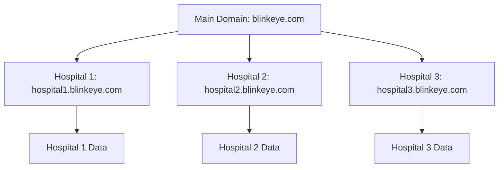
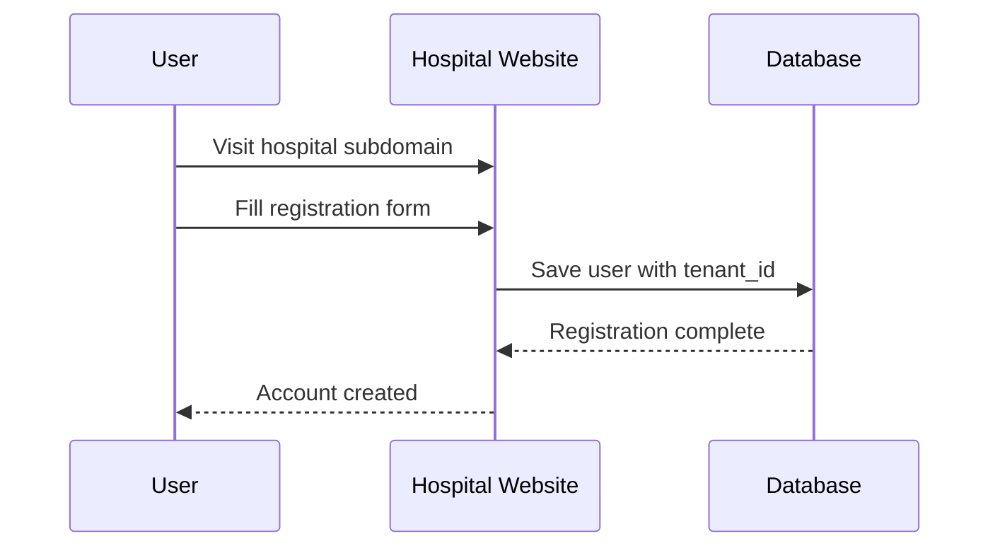
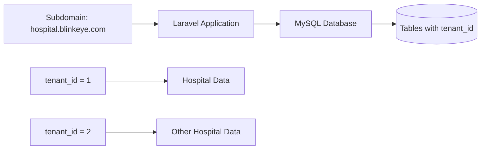

# Blink Eye Hospitals Platform

A simple, web-based healthcare management system for eye care hospitals. It helps hospitals manage patients, appointments, and records securely using separate websites for each hospital.

## How It Works

### Domain and Subdomain System

Each hospital gets its own website address (subdomain) under the main Blink Eye domain. This keeps data separate and secure.

- **Main Domain**: blinkeye.com - Platform management
- **Subdomains**: Each hospital like stjohns.blinkeye.com - Hospital-specific access
- **Isolation**: Data stays separate between hospitals

### User Registration Process

Users register through their hospital's subdomain. The system creates accounts in the database with hospital-specific data.

- **Registration**: Users sign up on their hospital's site
- **Database**: Stores user info with hospital ID (tenant_id)
- **Access**: Users can only see their hospital's data

### Database Integration with Subdomains

The database uses tenant_id to connect subdomains to their data. All queries filter by this ID for security.

- **Tenant ID**: Links subdomain to database records
- **Filtering**: Application ensures users see only their data
- **Security**: No cross-hospital data access

## Key Features

- **Patient Management**: Store medical records and history
- **Appointment Booking**: Schedule visits online
- **Doctor Portal**: Manage patient care
- **Billing**: Handle payments and insurance
- **Analytics**: View hospital performance
- **Secure**: Separate data per hospital

## Technology Stack

- **Frontend**: Blade templates with Tailwind CSS for responsive UI
- **Backend**: Monolithic Laravel application
- **Database**: MySQL for data storage
- **Cache**: Redis for speed
- **Hosting**: Cloud-based with subdomains

## Installation and Setup

*Note: This project is in planning phase. Setup instructions will be added later.*

### Prerequisites
- PHP (v8.1+)
- Composer
- MySQL (v8+)
- Redis

### Development Setup
1. Clone the repository
2. Install dependencies: `composer install`
3. Set up environment variables (.env file)
4. Initialize database: `php artisan migrate`
5. Start development server: `php artisan serve`

## Usage Guide

### For Patients
1. Visit your hospital's subdomain (e.g., stjohns.blinkeye.com)
2. Register for a patient portal account
3. Book appointments and view records

### For Healthcare Providers
1. Login to admin dashboard via hospital subdomain
2. Manage patients, appointments, and records

## Documentation

For more details, see:
- [`database_schema.md`](database_schema.md) - Database structure
- [`architecture_diagrams.md`](architecture_diagrams.md) - System diagrams
- [`business_analysis.md`](business_analysis.md) - Business overview

---

**Blink Eye Hospitals** - Simple healthcare management for eye care.

## Technology Stack

- **Backend**: Monolithic Laravel application for all business logic
- **Frontend**: Blade templates with Tailwind CSS for responsive and modern UI
- **Database**: MySQL for multi-tenant data isolation
- **Cache**: Redis for session management and data caching
- **File Storage**: Cloud storage solutions (AWS S3, Google Cloud Storage) for documents and images
- **Deployment**: Containerized with Docker for scalability
- **Security**: End-to-end encryption, OAuth 2.0, multi-factor authentication
- **Monitoring**: Real-time metrics and automated alerting systems

## Installation and Setup

*Note: This project is currently in the planning and design phase. Installation instructions will be provided once development begins.*

### Prerequisites
- PHP (v8.1+)
- Composer
- MySQL (v8+)
- Redis
- Docker and Docker Compose

### Development Setup
1. Clone the repository
2. Install dependencies: `composer install`
3. Set up environment variables (see `.env.example`)
4. Initialize database: `php artisan migrate`
5. Start development server: `php artisan serve`

### Production Deployment
- Use provided Docker Compose files for containerized deployment
- Configure reverse proxy for subdomain routing
- Set up SSL certificates for secure subdomains
- Initialize tenant configurations

For detailed setup instructions, refer to the deployment documentation once available.

## Usage Guide

### For Patients
1. **Access the Hospital Site**: Visit your hospital's subdomain (e.g., `stjohns.blinkeye.com`)
2. **Browse Services**: Explore available treatments and procedures
3. **Book Appointments**: Use the online booking system to schedule visits
4. **Manage Profile**: Register for a patient portal account to view records and communicate with providers
5. **Access Care**: Attend appointments, receive telemedicine consultations, and manage accommodations

### For Healthcare Providers
1. **Login to Admin Dashboard**: Access via `hospital.blinkeye.com/admin`
2. **Manage Patients**: View records, schedule appointments, update medical information
3. **Handle Appointments**: Review schedules, conduct consultations, update EHR
4. **Oversee Operations**: Monitor staff, manage inventory, review analytics
5. **Collaborate**: Use secure messaging and telemedicine features

### For Administrators
1. **Global Oversight**: Super Admins access platform-wide management via `admin.blinkeye.com`
2. **Tenant Management**: Configure hospital-specific settings, branding, and workflows
3. **User Management**: Assign roles, manage permissions, oversee compliance
4. **Analytics**: Review KPIs, generate reports, optimize operations

### Key Workflows
- **Patient Registration**: Create profiles, assign medical record numbers, set up portal access
- **Appointment Booking**: Select services/doctors, check availability, receive confirmations
- **Doctor Verification**: Upload credentials, undergo admin review and approval
- **Content Management**: Create/edit content, submit for approval, publish updates
- **Billing Processing**: Generate invoices, process payments, manage insurance claims

For detailed user flows and page structures, see [`plans/user_flows_outline.md`](plans/user_flows_outline.md).

## Contribution Guidelines

We welcome contributions to the Blink Eye Hospitals platform! Please follow these guidelines:

### Getting Started
1. Fork the repository
2. Create a feature branch: `git checkout -b feature/your-feature-name`
3. Make your changes following the established patterns
4. Write tests for new functionality
5. Ensure all tests pass and code is properly formatted

### Code Standards
- Follow PSR standards for PHP code
- Use Laravel conventions and best practices
- Implement proper error handling and logging
- Maintain comprehensive documentation for new features

### Pull Request Process
1. Update documentation for any changed functionality
2. Ensure your PR includes a clear description of changes
3. Reference any related issues
4. Request review from maintainers
5. Address feedback and make necessary revisions

### Areas for Contribution
- Frontend Blade templates and Tailwind CSS styling
- Backend Laravel controllers, models, and services
- Database schema optimizations
- Security enhancements
- Testing and quality assurance
- Documentation improvements

### Reporting Issues
- Use GitHub Issues for bug reports and feature requests
- Provide detailed descriptions with steps to reproduce
- Include relevant screenshots or error messages
- Specify your environment (OS, browser, etc.)

## Documentation

For comprehensive project documentation, refer to the following files:

- [`business_analysis.md`](business_analysis.md) - Detailed business analysis, requirements, and value proposition
- [`architecture_diagrams.md`](architecture_diagrams.md) - System architecture, data flows, and technical diagrams
- [`database_schema.md`](database_schema.md) - Complete database schema with tables, relationships, and constraints
- [`rbac_design.md`](rbac_design.md) - Role-Based Access Control system, permissions, and user roles
- [`plans/user_flows_outline.md`](plans/user_flows_outline.md) - User flows, page structures, and interaction designs

Additional documentation will be added as development progresses, including API references, deployment guides, and user manuals.

---

**Blink Eye Hospitals Platform** - Revolutionizing eye care through digital innovation and scalable healthcare solutions.