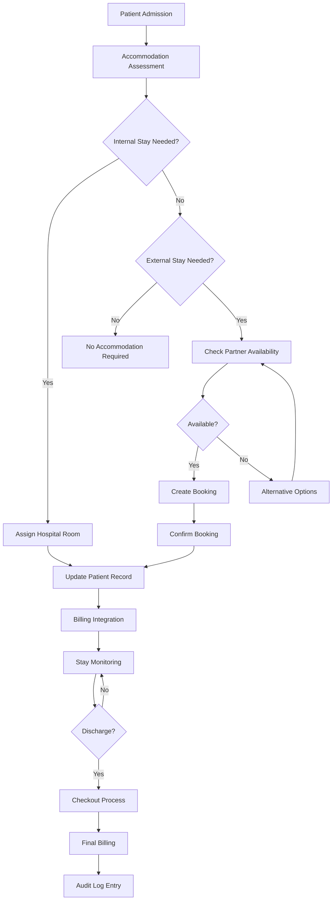
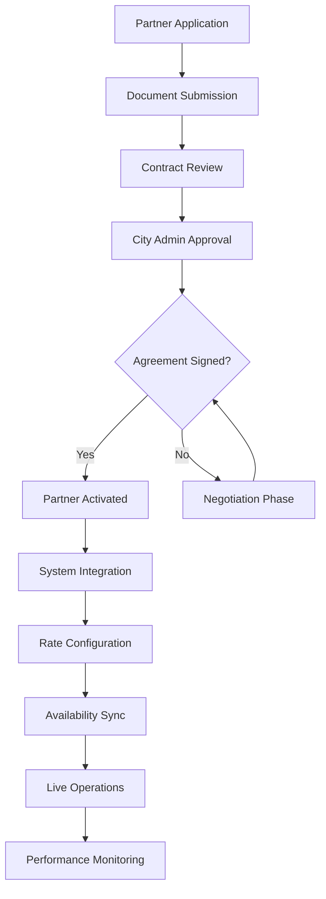

# Accommodation/Hotel Tie-Ups Module

## Purpose
The Accommodation/Hotel Tie-Ups module manages partnerships with hotels and accommodation providers to facilitate patient stays during treatment or recovery periods. It streamlines the process of arranging, booking, and managing patient accommodations while ensuring cost-effective solutions and seamless integration with hospital billing systems. The module supports both inpatient stays within hospital facilities and external hotel partnerships for extended care or out-of-town patients.

## Features

### Partnership Management
- **Partner Onboarding**: Register and verify hotel/accommodation partners
- **Contract Management**: Store partnership agreements, rates, and terms
- **Partner Portal**: Self-service portal for partners to update availability and rates
- **Performance Tracking**: Monitor partner reliability, booking fulfillment rates

### Accommodation Types
- **Hospital Rooms**: Internal accommodation management for inpatient stays
- **Hotel Partnerships**: External hotel bookings for extended stays or family accommodations
- **Recovery Centers**: Specialized facilities for post-treatment care
- **Emergency Housing**: Temporary arrangements for medical emergencies

### Booking and Reservation
- **Automated Booking**: Direct integration with partner booking systems
- **Availability Calendar**: Real-time availability checking across all partners
- **Dynamic Pricing**: Rate adjustments based on demand and hospital contracts
- **Group Bookings**: Bulk reservations for medical teams or patient groups

### Billing Integration
- **Seamless Billing**: Automatic inclusion in patient invoices
- **Insurance Coverage**: Support for accommodation coverage under medical insurance
- **Cost Tracking**: Detailed expense tracking for hospital administration
- **Payment Processing**: Integrated payment handling with partner settlements

### Patient Management
- **Patient Assignment**: Link accommodations to specific patient records
- **Stay Tracking**: Monitor admission/discharge dates and stay duration
- **Medical Integration**: Coordinate with treatment schedules and medical needs
- **Family Accommodations**: Separate booking system for patient families

## Database Tables

### accommodations
```sql
CREATE TABLE accommodations (
    id SERIAL PRIMARY KEY,
    tenant_id INTEGER NOT NULL REFERENCES tenants(id) ON DELETE CASCADE,
    patient_id INTEGER NOT NULL REFERENCES patients(id) ON DELETE CASCADE,
    room_number VARCHAR(20) NOT NULL,
    bed_number VARCHAR(10),
    admission_date TIMESTAMP NOT NULL,
    discharge_date TIMESTAMP,
    status VARCHAR(20) DEFAULT 'occupied' CHECK (status IN ('occupied', 'available', 'maintenance')),
    notes TEXT,
    created_at TIMESTAMP DEFAULT CURRENT_TIMESTAMP,
    updated_at TIMESTAMP DEFAULT CURRENT_TIMESTAMP
);

ALTER TABLE accommodations ENABLE ROW LEVEL SECURITY;
CREATE POLICY accommodations_tenant_isolation ON accommodations USING (tenant_id = current_setting('app.current_tenant_id')::INTEGER);

CREATE INDEX idx_accommodations_tenant_room ON accommodations(tenant_id, room_number);
CREATE INDEX idx_accommodations_tenant_patient ON accommodations(tenant_id, patient_id);
```

### accommodation_partners
```sql
CREATE TABLE accommodation_partners (
    id SERIAL PRIMARY KEY,
    tenant_id INTEGER NOT NULL REFERENCES tenants(id) ON DELETE CASCADE,
    partner_name VARCHAR(255) NOT NULL,
    partner_type VARCHAR(50) NOT NULL, -- 'hotel', 'recovery_center', 'hospital'
    contact_info JSONB,
    contract_details JSONB,
    status VARCHAR(20) DEFAULT 'active' CHECK (status IN ('active', 'inactive', 'terminated')),
    created_at TIMESTAMP DEFAULT CURRENT_TIMESTAMP,
    updated_at TIMESTAMP DEFAULT CURRENT_TIMESTAMP
);

ALTER TABLE accommodation_partners ENABLE ROW LEVEL SECURITY;
CREATE POLICY accommodation_partners_tenant_isolation ON accommodation_partners USING (tenant_id = current_setting('app.current_tenant_id')::INTEGER);

CREATE INDEX idx_accommodation_partners_tenant_name ON accommodation_partners(tenant_id, partner_name);
```

### accommodation_bookings
```sql
CREATE TABLE accommodation_bookings (
    id SERIAL PRIMARY KEY,
    tenant_id INTEGER NOT NULL REFERENCES tenants(id) ON DELETE CASCADE,
    patient_id INTEGER REFERENCES patients(id),
    partner_id INTEGER NOT NULL REFERENCES accommodation_partners(id) ON DELETE CASCADE,
    booking_reference VARCHAR(100) UNIQUE NOT NULL,
    check_in_date TIMESTAMP NOT NULL,
    check_out_date TIMESTAMP,
    room_type VARCHAR(100),
    number_of_guests INTEGER DEFAULT 1,
    total_cost DECIMAL(10,2),
    status VARCHAR(20) DEFAULT 'confirmed' CHECK (status IN ('confirmed', 'checked_in', 'checked_out', 'cancelled')),
    special_requests TEXT,
    created_at TIMESTAMP DEFAULT CURRENT_TIMESTAMP,
    updated_at TIMESTAMP DEFAULT CURRENT_TIMESTAMP
);

ALTER TABLE accommodation_bookings ENABLE ROW LEVEL SECURITY;
CREATE POLICY accommodation_bookings_tenant_isolation ON accommodation_bookings USING (tenant_id = current_setting('app.current_tenant_id')::INTEGER);

CREATE INDEX idx_accommodation_bookings_tenant_patient ON accommodation_bookings(tenant_id, patient_id);
CREATE INDEX idx_accommodation_bookings_tenant_partner ON accommodation_bookings(tenant_id, partner_id);
```

**Key Relationships**:
- `accommodations` for internal hospital stays
- `accommodation_partners` for managing external partnerships
- `accommodation_bookings` for external hotel reservations

## Workflows

### Patient Accommodation Assignment Workflow


**Process Steps**:
1. Patient admission triggers accommodation assessment
2. Determine if internal hospital stay or external accommodation needed
3. For internal stays: assign available rooms/beds
4. For external stays: check partner availability and rates
5. Create booking with partner system integration
6. Update patient records with accommodation details
7. Integrate with billing system for automatic invoicing
8. Monitor stay duration and status
9. Process checkout and final settlement upon discharge

### Partner Onboarding Workflow


**Process Steps**:
1. Potential partners submit application with credentials
2. Review partnership agreements and terms
3. City Admin approval for contract terms
4. Digital signature and contract finalization
5. System integration setup (API keys, booking endpoints)
6. Configure rates and availability parameters
7. Enable live booking operations
8. Ongoing performance monitoring and contract renewals

## User Interactions

### For Hospital Staff
- **Accommodation Dashboard**: Overview of room occupancy and availability
- **Patient Assignment Interface**: Quick room assignment during admission
- **Booking Portal**: Search and book external accommodations
- **Partner Management**: Add/edit partner details and contracts
- **Reporting Tools**: Occupancy reports and utilization analytics

### For Patients/Families
- **Patient Portal**: View accommodation details and booking confirmations
- **Check-in/Check-out**: Self-service options for external stays
- **Billing Transparency**: View accommodation charges in patient invoices
- **Feedback System**: Rate and review accommodation experiences

### For Partners
- **Partner Portal**: Update availability, rates, and room inventory
- **Booking Management**: View and manage hospital bookings
- **Reporting Dashboard**: Revenue reports and booking analytics
- **Contract Management**: Access current agreements and renewal options

## API Endpoints

### Accommodation Management Endpoints
- `GET /api/v1/accommodations/availability` - Check room availability
- `POST /api/v1/accommodations/assign` - Assign room to patient
- `PUT /api/v1/accommodations/{id}/checkout` - Process checkout
- `GET /api/v1/accommodations/{id}/details` - Get accommodation details

### Partner Management Endpoints
- `POST /api/v1/partners` - Register new partner
- `GET /api/v1/partners` - List active partners
- `PUT /api/v1/partners/{id}` - Update partner information
- `POST /api/v1/partners/{id}/rates` - Update partner rates

### Booking Endpoints
- `POST /api/v1/bookings` - Create new booking
- `GET /api/v1/bookings/{reference}` - Get booking details
- `PUT /api/v1/bookings/{reference}/cancel` - Cancel booking
- `POST /api/v1/bookings/search` - Search available accommodations

**Authentication**: JWT with tenant context and role-based permissions
**Rate Limiting**: Booking endpoints protected against abuse
**Real-time Updates**: WebSocket integration for availability changes

## Integration Points

### Internal Integrations
- **Patient Management**: Links to `patients` table for stay tracking
- **Billing System**: Automatic invoice generation for accommodation charges
- **Appointment System**: Coordinate stays with treatment schedules
- **EHR System**: Medical notes integration for accommodation requirements

### External Integrations
- **Hotel Booking APIs**: Integration with major hotel chains and booking platforms
- **Payment Gateways**: Secure payment processing for external bookings
- **Calendar Systems**: Sync with partner availability calendars
- **Mapping Services**: Location-based accommodation recommendations

### Workflow Integrations
- **Admission Process**: Trigger accommodation assessment during patient intake
- **Discharge Planning**: Coordinate checkout with medical discharge
- **Insurance Claims**: Submit accommodation costs for insurance processing
- **Reporting System**: Include accommodation metrics in hospital dashboards

## Security Considerations
- **Data Privacy**: Patient location data protected under HIPAA
- **Partner Verification**: Thorough background checks for accommodation partners
- **Payment Security**: PCI-compliant payment processing
- **Access Control**: Role-based permissions for booking and partner management

## Performance Optimization
- **Caching**: Availability data cached for fast responses
- **Load Balancing**: Distribute booking requests across partner APIs
- **Background Sync**: Asynchronous synchronization with partner systems
- **Database Optimization**: Partitioned tables for large-scale operations

## Monitoring and Analytics
- **Occupancy Metrics**: Track hospital room utilization rates
- **Partner Performance**: Monitor booking fulfillment and quality scores
- **Cost Analysis**: Detailed reporting on accommodation expenses
- **Patient Satisfaction**: Collect and analyze accommodation feedback