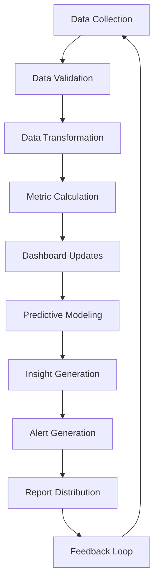
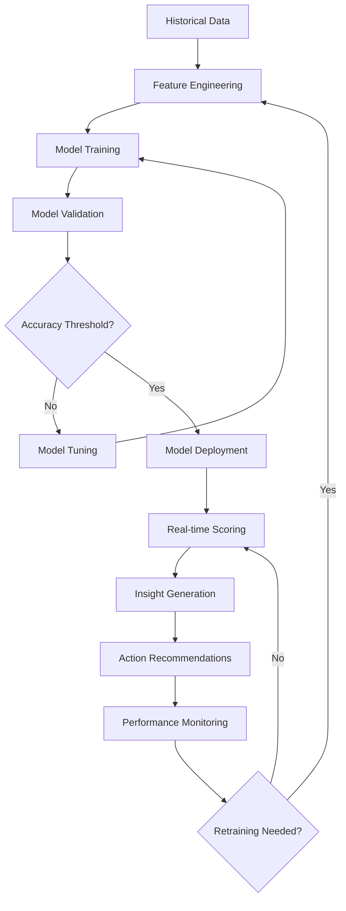

# Analytics & Intelligence Layer Module

## Purpose
The Analytics & Intelligence Layer module provides comprehensive business intelligence and data analytics capabilities for the Blink Eye Hospitals platform. It transforms raw operational data into actionable insights, enabling data-driven decision making across all hospital functions. The module includes real-time dashboards, predictive analytics, and AI-powered recommendations to optimize patient care, operational efficiency, and business performance.

## Features

### Real-Time Dashboards
- **Executive Dashboard**: High-level KPIs for hospital management
- **Clinical Dashboard**: Patient outcomes, treatment effectiveness, doctor performance
- **Operational Dashboard**: Resource utilization, appointment scheduling, revenue metrics
- **Patient Experience Dashboard**: Satisfaction scores, wait times, feedback analytics

### Predictive Analytics
- **Appointment Optimization**: Predict no-shows and optimize scheduling
- **Patient Flow Forecasting**: Anticipate admission rates and resource needs
- **Revenue Forecasting**: Predict billing cycles and cash flow
- **Inventory Optimization**: Forecast medical supply requirements

### AI-Powered Insights
- **Clinical Decision Support**: AI recommendations for treatment plans
- **Patient Risk Assessment**: Identify high-risk patients for proactive care
- **Operational Efficiency**: Automated identification of process bottlenecks
- **Personalized Marketing**: AI-driven patient segmentation and targeting

### Advanced Reporting
- **Custom Report Builder**: Drag-and-drop report creation
- **Scheduled Reports**: Automated delivery of key metrics
- **Ad-hoc Analysis**: Self-service data exploration tools
- **Regulatory Reporting**: Automated compliance and audit reports

### Data Visualization
- **Interactive Charts**: Dynamic visualizations with drill-down capabilities
- **Geographic Mapping**: Location-based analytics for service areas
- **Trend Analysis**: Time-series analysis with forecasting
- **Comparative Analysis**: Benchmarking against industry standards

## Database Tables

### analytics_dashboards
```sql
CREATE TABLE analytics_dashboards (
    id SERIAL PRIMARY KEY,
    tenant_id INTEGER NOT NULL REFERENCES tenants(id) ON DELETE CASCADE,
    dashboard_name VARCHAR(255) NOT NULL,
    dashboard_type VARCHAR(50) NOT NULL, -- 'executive', 'clinical', 'operational'
    config JSONB, -- dashboard layout and widget configurations
    is_public BOOLEAN DEFAULT FALSE,
    created_by INTEGER NOT NULL REFERENCES users(id),
    created_at TIMESTAMP DEFAULT CURRENT_TIMESTAMP,
    updated_at TIMESTAMP DEFAULT CURRENT_TIMESTAMP
);

ALTER TABLE analytics_dashboards ENABLE ROW LEVEL SECURITY;
CREATE POLICY analytics_dashboards_tenant_isolation ON analytics_dashboards USING (tenant_id = current_setting('app.current_tenant_id')::INTEGER);

CREATE INDEX idx_analytics_dashboards_tenant_type ON analytics_dashboards(tenant_id, dashboard_type);
```

### analytics_reports
```sql
CREATE TABLE analytics_reports (
    id SERIAL PRIMARY KEY,
    tenant_id INTEGER NOT NULL REFERENCES tenants(id) ON DELETE CASCADE,
    report_name VARCHAR(255) NOT NULL,
    report_type VARCHAR(50) NOT NULL, -- 'scheduled', 'ad_hoc', 'regulatory'
    query_definition JSONB, -- report query and parameters
    schedule_config JSONB, -- scheduling information for automated reports
    recipients JSONB, -- email recipients for scheduled reports
    last_run_at TIMESTAMP,
    status VARCHAR(20) DEFAULT 'active' CHECK (status IN ('active', 'paused', 'archived')),
    created_by INTEGER NOT NULL REFERENCES users(id),
    created_at TIMESTAMP DEFAULT CURRENT_TIMESTAMP,
    updated_at TIMESTAMP DEFAULT CURRENT_TIMESTAMP
);

ALTER TABLE analytics_reports ENABLE ROW LEVEL SECURITY;
CREATE POLICY analytics_reports_tenant_isolation ON analytics_reports USING (tenant_id = current_setting('app.current_tenant_id')::INTEGER);

CREATE INDEX idx_analytics_reports_tenant_type ON analytics_reports(tenant_id, report_type);
```

### analytics_metrics
```sql
CREATE TABLE analytics_metrics (
    id SERIAL PRIMARY KEY,
    tenant_id INTEGER NOT NULL REFERENCES tenants(id) ON DELETE CASCADE,
    metric_name VARCHAR(100) NOT NULL,
    metric_category VARCHAR(50) NOT NULL, -- 'clinical', 'financial', 'operational'
    value DECIMAL(15,4),
    dimensions JSONB, -- additional context (date, department, etc.)
    calculated_at TIMESTAMP DEFAULT CURRENT_TIMESTAMP
);

ALTER TABLE analytics_metrics ENABLE ROW LEVEL SECURITY;
CREATE POLICY analytics_metrics_tenant_isolation ON analytics_metrics USING (tenant_id = current_setting('app.current_tenant_id')::INTEGER);

CREATE INDEX idx_analytics_metrics_tenant_category ON analytics_metrics(tenant_id, metric_category);
CREATE INDEX idx_analytics_metrics_calculated_at ON analytics_metrics(calculated_at);
```

### predictive_models
```sql
CREATE TABLE predictive_models (
    id SERIAL PRIMARY KEY,
    tenant_id INTEGER NOT NULL REFERENCES tenants(id) ON DELETE CASCADE,
    model_name VARCHAR(255) NOT NULL,
    model_type VARCHAR(50) NOT NULL, -- 'appointment_no_show', 'patient_readmission'
    algorithm VARCHAR(100) NOT NULL,
    parameters JSONB,
    accuracy_score DECIMAL(5,4),
    training_data_range JSONB,
    last_trained_at TIMESTAMP,
    status VARCHAR(20) DEFAULT 'active' CHECK (status IN ('active', 'training', 'retired')),
    created_at TIMESTAMP DEFAULT CURRENT_TIMESTAMP,
    updated_at TIMESTAMP DEFAULT CURRENT_TIMESTAMP
);

ALTER TABLE predictive_models ENABLE ROW LEVEL SECURITY;
CREATE POLICY predictive_models_tenant_isolation ON predictive_models USING (tenant_id = current_setting('app.current_tenant_id')::INTEGER);

CREATE INDEX idx_predictive_models_tenant_type ON predictive_models(tenant_id, model_type);
```

**Key Relationships**:
- `analytics_dashboards` stores dashboard configurations
- `analytics_reports` manages report definitions and scheduling
- `analytics_metrics` stores calculated KPIs and metrics
- `predictive_models` tracks AI/ML models and their performance

## Workflows

### Data Processing and Analytics Workflow


**Process Steps**:
1. Raw data collected from all platform modules
2. Data validation and cleansing for accuracy
3. Transformation into analytics-ready format
4. KPI and metric calculations
5. Real-time dashboard updates
6. Predictive model training and scoring
7. AI-generated insights and recommendations
8. Automated alerts for critical thresholds
9. Scheduled report generation and distribution
10. User feedback incorporated into model improvements

### Predictive Analytics Workflow


**Process Steps**:
1. Historical data aggregated from operational systems
2. Feature engineering to create predictive variables
3. Machine learning model training
4. Cross-validation and performance testing
5. Model tuning for optimal accuracy
6. Deployment to production environment
7. Real-time scoring of new data
8. Generation of actionable insights
9. Automated recommendations to users
10. Continuous monitoring and periodic retraining

## User Interactions

### For Executives (Medical Director, City Admin)
- **Executive Dashboard**: High-level KPIs, financial metrics, patient volumes
- **Trend Analysis**: Long-term performance trends and forecasts
- **Benchmarking**: Comparison against industry standards and peer hospitals
- **Strategic Insights**: AI-generated recommendations for strategic decisions

### For Clinical Staff (Doctors)
- **Clinical Performance**: Patient outcomes, treatment effectiveness, complication rates
- **Patient Risk Dashboard**: High-risk patient identification and monitoring
- **Decision Support**: AI recommendations for treatment plans
- **Quality Metrics**: Compliance with clinical guidelines and protocols

### For Operational Staff
- **Resource Utilization**: Staff scheduling, equipment usage, room occupancy
- **Process Efficiency**: Bottleneck identification and optimization opportunities
- **Patient Flow**: Admission/discharge patterns and capacity planning
- **Cost Analysis**: Expense tracking and cost-saving recommendations

### For Administrators
- **Custom Dashboard Builder**: Create personalized dashboards
- **Report Scheduler**: Set up automated report delivery
- **Data Export**: Bulk data export for external analysis
- **Alert Configuration**: Set up custom alerts and thresholds

## API Endpoints

### Dashboard Endpoints
- `GET /api/v1/analytics/dashboards` - List available dashboards
- `GET /api/v1/analytics/dashboards/{id}` - Get dashboard configuration
- `POST /api/v1/analytics/dashboards` - Create custom dashboard
- `PUT /api/v1/analytics/dashboards/{id}` - Update dashboard

### Reporting Endpoints
- `POST /api/v1/analytics/reports` - Create new report
- `GET /api/v1/analytics/reports/{id}/run` - Execute report
- `POST /api/v1/analytics/reports/{id}/schedule` - Schedule automated report
- `GET /api/v1/analytics/reports/scheduled` - List scheduled reports

### Metrics Endpoints
- `GET /api/v1/analytics/metrics` - Query metrics with filters
- `POST /api/v1/analytics/metrics/batch` - Bulk metric retrieval
- `GET /api/v1/analytics/metrics/{name}/history` - Get metric time series

### Predictive Endpoints
- `POST /api/v1/analytics/predict/{model_type}` - Get predictions
- `GET /api/v1/analytics/models` - List available models
- `GET /api/v1/analytics/models/{id}/performance` - Get model accuracy metrics

**Authentication**: JWT with tenant context and role-based data filtering
**Caching**: Aggressive caching for dashboard data to ensure performance
**Rate Limiting**: Analytics queries limited to prevent system overload

## Integration Points

### Internal Integrations
- **All Platform Modules**: Data collection from patients, appointments, billing, etc.
- **RBAC System**: Role-based access to sensitive analytics data
- **Audit Logging**: Analytics access and data exports tracked
- **Notification System**: Automated alerts based on analytics thresholds

### External Integrations
- **Business Intelligence Tools**: Tableau, Power BI for advanced analysis
- **Data Warehouses**: Integration with cloud data warehouses
- **ML Platforms**: Google AI Platform, AWS SageMaker for model training
- **Visualization Libraries**: D3.js, Chart.js for custom dashboards

### Workflow Integrations
- **Appointment System**: No-show predictions integrated into scheduling
- **Inventory Management**: Predictive ordering based on usage patterns
- **Patient Care**: Risk scores integrated into clinical workflows
- **Financial Planning**: Revenue forecasts integrated into budgeting

## Security Considerations
- **Data Anonymization**: Sensitive patient data aggregated and anonymized
- **Access Controls**: Granular permissions for different data types
- **Audit Trails**: Complete logging of analytics access and queries
- **Compliance**: HIPAA/GDPR compliant data handling and retention

## Performance Optimization
- **Data Warehousing**: Separate analytics database for complex queries
- **ETL Pipelines**: Efficient data extraction and transformation
- **Caching Layers**: Redis/Memcached for frequently accessed metrics
- **Horizontal Scaling**: Distributed processing for large datasets

## Monitoring and Analytics
- **System Performance**: Query execution times, data freshness metrics
- **Model Performance**: Prediction accuracy, model drift detection
- **User Engagement**: Dashboard usage, report popularity
- **Data Quality**: Completeness, accuracy, and timeliness metrics