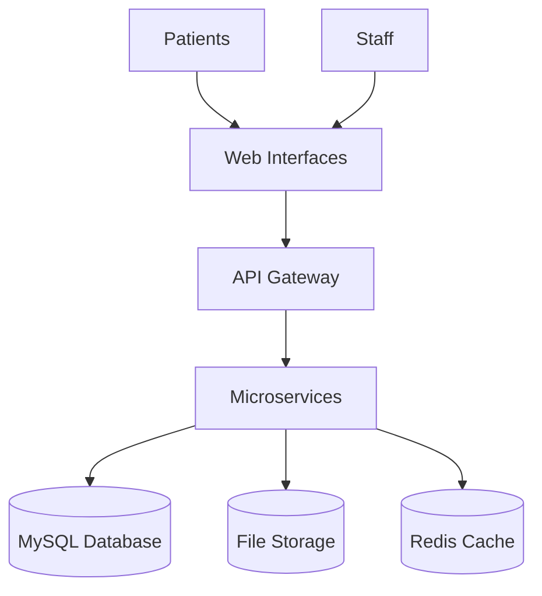
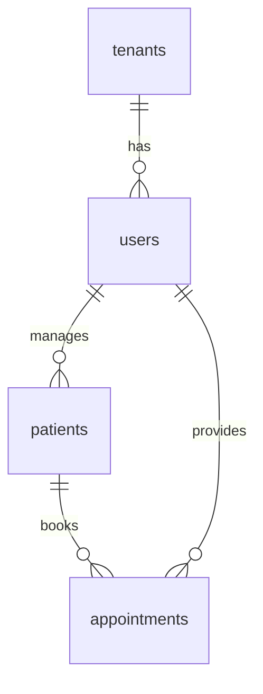

# Blink Eye Hospitals: System Architecture

## Overview

The platform uses a cloud-based setup with separate websites for each hospital.

## Key Diagrams

### Database Structure

### User Roles
- Super Admin: Full access
- Hospital Admin: Hospital management
- Doctor: Patient care
- Patient: Self-service