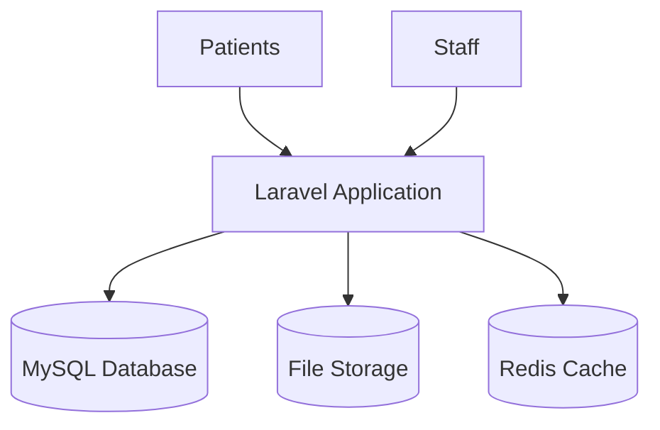
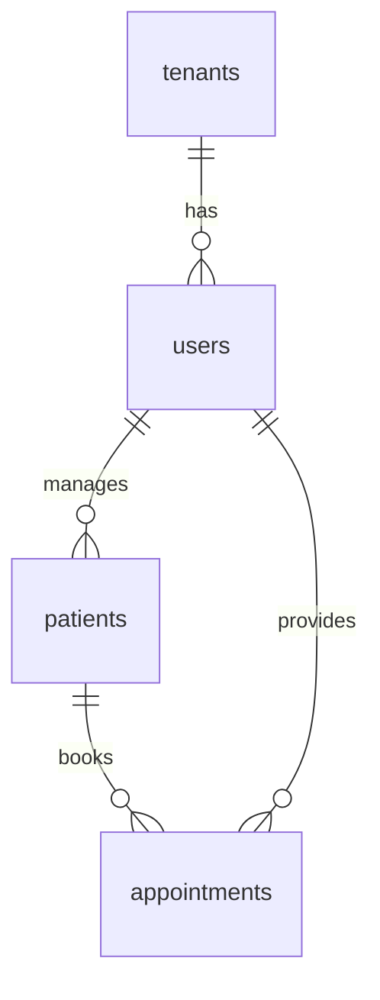

# Blink Eye Hospitals: System Architecture

## Overview

The platform uses a cloud-based setup with separate websites for each hospital. The backend is a monolithic Laravel application that handles all business logic, with frontend rendered using Blade templates styled with Tailwind CSS for responsive and modern UI.

## Key Diagrams

### Database Structure

### User Roles
- Super Admin: Full access
- Hospital Admin: Hospital management
- Doctor: Patient care
- Patient: Self-service