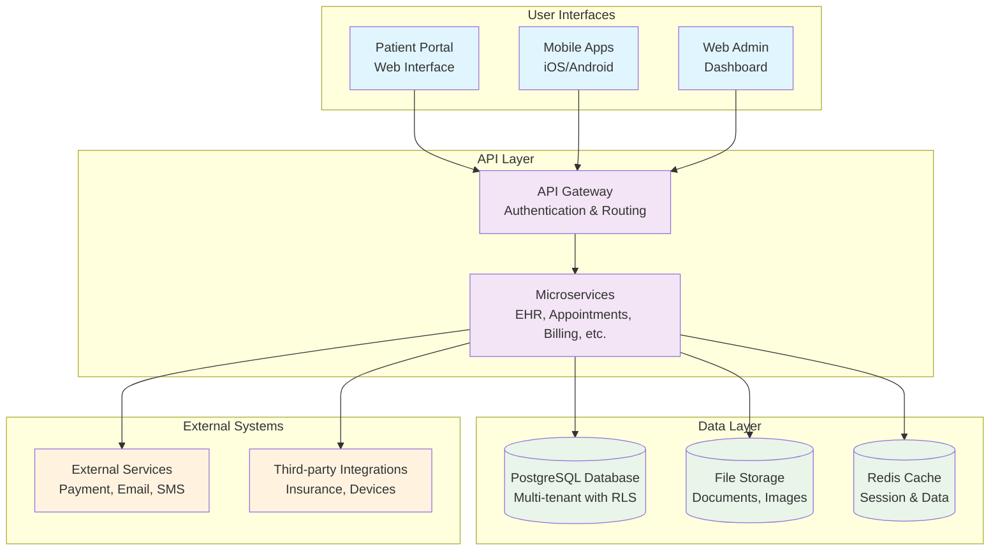
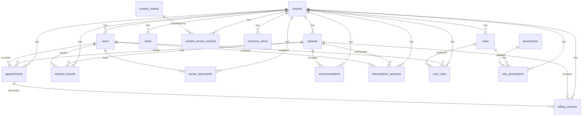
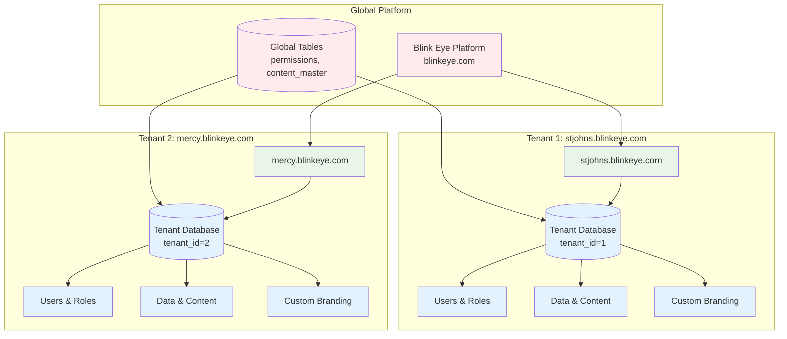
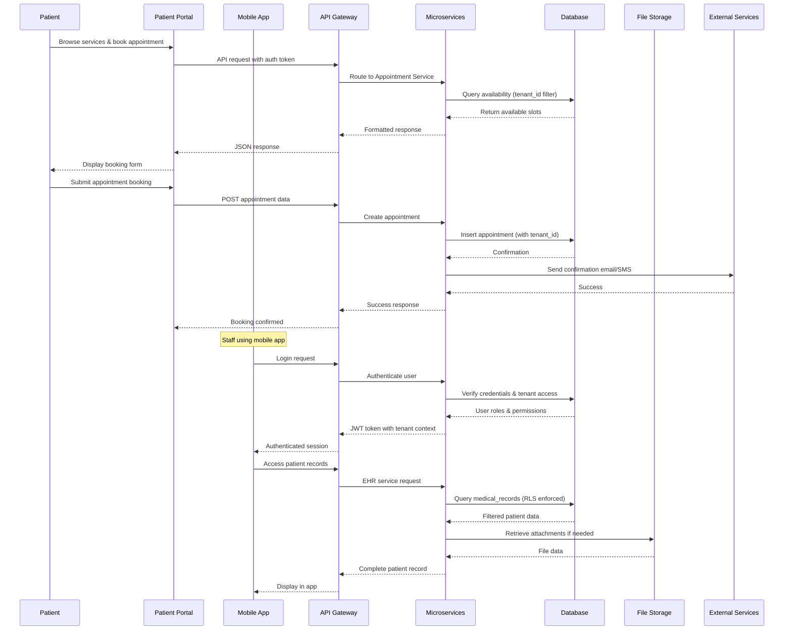
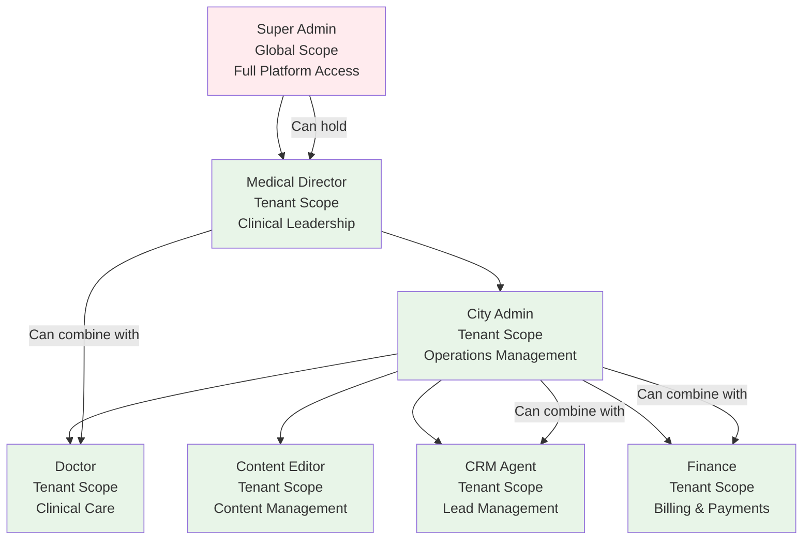

# Blink Eye Hospitals Platform: Architecture Diagrams

This document provides a comprehensive set of architecture diagrams for the Blink Eye Hospitals platform, consolidating and enhancing designs from previous analyses. All diagrams are created using Mermaid format for clarity and consistency.

## 1. System Overview

### Explanation
This system overview diagram illustrates the high-level architecture of the Blink Eye Hospitals platform. The platform follows a multi-tenant, cloud-based architecture with subdomain isolation. Key components include:

- **User Interfaces**: Patient portal for self-service, mobile apps for on-the-go access, and web admin dashboards for hospital staff
- **API Layer**: API Gateway handles authentication, routing, and load balancing; microservices provide modular functionality for different business domains
- **Data Layer**: PostgreSQL with Row-Level Security (RLS) for tenant isolation, file storage for documents/images, and Redis for caching
- **External Systems**: Integrations with payment processors, communication services, and third-party healthcare systems

The architecture supports horizontal scaling, with each tenant operating in isolation while sharing the underlying infrastructure.

## 2. Database ERD

### Explanation
The Entity-Relationship Diagram (ERD) shows the multi-tenant database schema designed for the Blink Eye platform. Key features include:

- **Tenant Isolation**: All tenant-specific tables include a `tenant_id` foreign key to the `tenants` table
- **Row-Level Security**: PostgreSQL RLS policies ensure users can only access data for their assigned tenant
- **RBAC Integration**: Users, roles, and permissions are managed per tenant, with global permissions assigned to roles
- **Core Entities**: Patients, appointments, medical records, and billing form the heart of the EHR system
- **Operational Support**: Tables for inventory, telemedicine, accommodations, and content management support comprehensive hospital operations
- **Scalability**: Designed for partitioning by `tenant_id` to support horizontal scaling across multiple database instances

## 3. Tenant Model

### Explanation
The tenant model diagram illustrates the multi-tenant architecture with subdomain-based isolation. Key aspects include:

- **Subdomain Isolation**: Each hospital operates on a unique subdomain (e.g., stjohns.blinkeye.com) ensuring complete separation
- **Data Partitioning**: All tenant data is tagged with `tenant_id` and protected by Row-Level Security policies
- **Shared Infrastructure**: Tenants share the same application code and database schema while maintaining data isolation
- **Customization**: Each tenant can have custom branding, content variants, and workflow configurations
- **Global vs. Tenant Scope**: Global tables (permissions, content_master) are shared across tenants, while tenant-specific tables are isolated
- **Scalability**: Architecture supports adding new tenants without code changes, with potential for database sharding by tenant_id

## 4. Data Flow

### Explanation
The data flow diagram shows how information moves through the Blink Eye platform, emphasizing tenant isolation and security. Key flows include:

- **Patient Interactions**: Patients access the system through web portals or mobile apps, with all requests routed through the API Gateway
- **Authentication & Authorization**: Every request includes tenant context and user authentication, with RBAC permissions checked at the service layer
- **Data Isolation**: All database queries include `tenant_id` filters, enforced by Row-Level Security policies
- **Service Orchestration**: Microservices handle business logic, coordinating between database, file storage, and external services
- **External Integrations**: Communication with payment processors, email/SMS services, and third-party healthcare systems
- **Audit Trail**: All data access and modifications are logged for compliance and security monitoring

## 5. RBAC Hierarchy

### Explanation
The RBAC hierarchy diagram shows the role-based access control structure with inheritance and multi-role capabilities. Key features include:

- **Hierarchical Permissions**: Higher-level roles inherit all permissions from lower-level roles in the hierarchy
- **Scope Levels**: Super Admin has global access across all tenants; all other roles are tenant-specific
- **Multi-Role Support**: Users can hold multiple roles simultaneously, with permissions combined (union-based)
- **Role Definitions**:
  - **Super Admin**: Platform-wide management, tenant onboarding, system administration
  - **Medical Director**: Clinical oversight, staff management, quality assurance
  - **City Admin**: Operational management, resource allocation, policy implementation
  - **Doctor**: Patient care, medical records, appointment management
  - **Content Editor**: Website content, email templates, patient communications
  - **CRM Agent**: Lead management, patient outreach, conversion tracking
  - **Finance**: Billing, invoicing, payment processing, financial reporting
- **Permission Inheritance**: Ensures efficient permission management while maintaining security
- **Tenant Isolation**: All tenant-specific roles are restricted to their assigned tenant's data

These diagrams provide a comprehensive architectural overview of the Blink Eye Hospitals platform, supporting its goals of scalability, security, and multi-tenant operation.