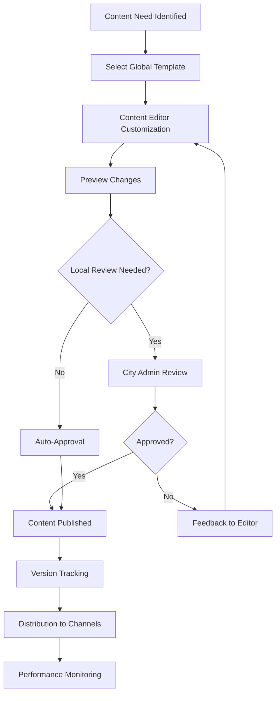
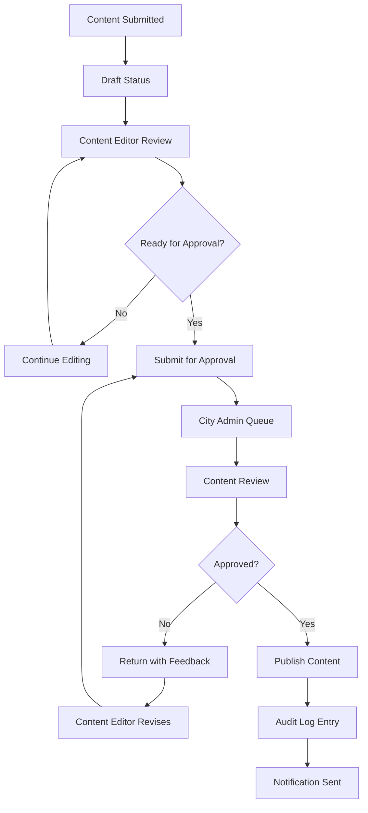

# Content System Module

## Purpose
The Content System module provides a centralized platform for managing hospital-specific content including website pages, email templates, patient communications, and marketing materials. It enables efficient content creation, customization, and publishing while maintaining consistency across all hospital touchpoints. The system supports both global content templates and tenant-specific customizations, ensuring brand consistency while allowing local adaptations.

## Features

### Content Template Management
- **Global Templates**: Pre-built content templates for common hospital communications
- **Template Categories**: Organized by content type (emails, web pages, forms, notifications)
- **Version Control**: Track changes and maintain content history
- **Template Inheritance**: Base templates with customizable sections

### Tenant Customization
- **Localized Content**: Adapt global templates for local languages and regulations
- **Branding Integration**: Incorporate hospital logos, colors, and messaging
- **Dynamic Content**: Insert patient-specific or context-aware information
- **Approval Workflows**: Multi-level review process for content changes

### Content Types Supported
- **Email Templates**: Appointment confirmations, reminders, follow-up communications
- **Web Content**: Hospital website pages, service descriptions, patient resources
- **Patient Forms**: Registration forms, consent documents, intake questionnaires
- **Marketing Materials**: Brochures, newsletters, promotional content
- **Internal Communications**: Staff announcements, policy documents

### Publishing and Distribution
- **Multi-Channel Publishing**: Automatic distribution to web, email, and mobile platforms
- **Scheduled Publishing**: Time-based content release and expiration
- **A/B Testing**: Test different content variations for effectiveness
- **Content Analytics**: Track engagement and performance metrics

### Compliance and Governance
- **Regulatory Compliance**: Ensure content meets healthcare regulations
- **Content Approval**: Mandatory review for sensitive medical communications
- **Audit Trails**: Complete history of content changes and approvals
- **Data Privacy**: Protect patient information in communications

## Database Tables

### content_master
```sql
CREATE TABLE content_master (
    id SERIAL PRIMARY KEY,
    content_type VARCHAR(50) NOT NULL, -- e.g., 'email_template', 'page_content'
    title VARCHAR(255) NOT NULL,
    default_content TEXT,
    metadata JSONB,
    created_at TIMESTAMP DEFAULT CURRENT_TIMESTAMP,
    updated_at TIMESTAMP DEFAULT CURRENT_TIMESTAMP
);

-- No tenant_id, global table
CREATE INDEX idx_content_master_type ON content_master(content_type);
```

### content_tenant_variants
```sql
CREATE TABLE content_tenant_variants (
    id SERIAL PRIMARY KEY,
    tenant_id INTEGER NOT NULL REFERENCES tenants(id) ON DELETE CASCADE,
    content_master_id INTEGER NOT NULL REFERENCES content_master(id) ON DELETE CASCADE,
    customized_content TEXT,
    is_active BOOLEAN DEFAULT TRUE,
    created_at TIMESTAMP DEFAULT CURRENT_TIMESTAMP,
    updated_at TIMESTAMP DEFAULT CURRENT_TIMESTAMP,
    UNIQUE(tenant_id, content_master_id)
);

ALTER TABLE content_tenant_variants ENABLE ROW LEVEL SECURITY;
CREATE POLICY content_tenant_variants_tenant_isolation ON content_tenant_variants USING (tenant_id = current_setting('app.current_tenant_id')::INTEGER);

CREATE INDEX idx_content_tenant_variants_tenant_master ON content_tenant_variants(tenant_id, content_master_id);
```

### content_versions
```sql
CREATE TABLE content_versions (
    id SERIAL PRIMARY KEY,
    tenant_id INTEGER NOT NULL REFERENCES tenants(id) ON DELETE CASCADE,
    content_variant_id INTEGER NOT NULL REFERENCES content_tenant_variants(id) ON DELETE CASCADE,
    version_number INTEGER NOT NULL,
    content TEXT NOT NULL,
    changed_by INTEGER NOT NULL REFERENCES users(id),
    change_reason TEXT,
    created_at TIMESTAMP DEFAULT CURRENT_TIMESTAMP
);

ALTER TABLE content_versions ENABLE ROW LEVEL SECURITY;
CREATE POLICY content_versions_tenant_isolation ON content_versions USING (tenant_id = current_setting('app.current_tenant_id')::INTEGER);

CREATE INDEX idx_content_versions_tenant_variant ON content_versions(tenant_id, content_variant_id);
```

**Key Relationships**:
- `content_master` stores global templates
- `content_tenant_variants` stores tenant-specific customizations
- `content_versions` tracks all content changes for audit purposes

## Workflows

### Content Creation and Customization Workflow


**Process Steps**:
1. Identify content requirement (new template or customization)
2. Select appropriate global template as base
3. Content Editor makes tenant-specific customizations
4. Preview changes in staging environment
5. Optional City Admin review for compliance
6. Approved content published to live systems
7. Version history maintained for audit purposes
8. Content distributed to all relevant channels
9. Monitor engagement and effectiveness

### Content Approval Workflow


**Process Steps**:
1. Content Editor completes customization and submits for approval
2. Content enters approval queue for designated reviewers
3. City Admin reviews content for compliance and quality
4. Approved content published immediately or scheduled
5. Rejected content returned with specific feedback
6. All approvals and rejections logged in audit trail
7. Stakeholders notified of content updates

## User Interactions

### For Content Editors
- **Template Browser**: Search and select from global content templates
- **Visual Editor**: WYSIWYG editor for content customization
- **Variable Insertion**: Add dynamic content placeholders (patient name, appointment time)
- **Preview Mode**: See how content will appear across different channels
- **Version History**: Compare changes and revert if needed
- **Bulk Operations**: Update multiple content items simultaneously

### For Administrators (City Admin)
- **Approval Dashboard**: Queue of pending content for review
- **Content Comparison**: Side-by-side view of changes
- **Approval Workflow**: One-click approve/reject with comments
- **Bulk Approvals**: Process multiple items efficiently
- **Content Analytics**: View performance metrics and engagement data

### For End Users (Patients/Staff)
- **Personalized Communications**: Receive customized emails and notifications
- **Web Portal**: Access hospital-specific web content
- **Multi-language Support**: Content delivered in preferred language
- **Mobile Optimization**: Responsive content across all devices

## API Endpoints

### Content Management Endpoints
- `GET /api/v1/content/templates` - List available global templates
- `GET /api/v1/content/templates/{id}` - Get template details
- `POST /api/v1/content/variants` - Create tenant-specific variant
- `PUT /api/v1/content/variants/{id}` - Update customized content
- `DELETE /api/v1/content/variants/{id}` - Delete content variant

### Publishing Endpoints
- `POST /api/v1/content/variants/{id}/publish` - Publish content variant
- `POST /api/v1/content/variants/{id}/schedule` - Schedule content publication
- `GET /api/v1/content/variants/{id}/versions` - Get version history

### Approval Endpoints
- `GET /api/v1/content/pending-approval` - Get content awaiting approval
- `POST /api/v1/content/{id}/approve` - Approve content changes
- `POST /api/v1/content/{id}/reject` - Reject with feedback

**Authentication**: JWT authentication with tenant context
**Authorization**: Role-based permissions (Content Editor, City Admin)
**Caching**: Content served through CDN for performance
**Validation**: Content validation for security and compliance

## Integration Points

### Internal Integrations
- **RBAC System**: Permission controls for content creation and approval
- **User Management**: Link content changes to specific users
- **Audit Logging**: All content operations tracked for compliance
- **Notification System**: Alerts for content approvals and publications

### External Integrations
- **Email Service Providers**: SendGrid, Mailchimp for email delivery
- **CMS Platforms**: WordPress, Drupal for web content management
- **Translation Services**: Google Translate, professional translation APIs
- **Analytics Platforms**: Google Analytics for content performance tracking

### Workflow Integrations
- **Patient Communications**: Trigger automated emails based on patient events
- **Appointment System**: Send reminders and confirmations
- **Marketing Campaigns**: Coordinate content with promotional activities
- **Compliance Reporting**: Include content metrics in regulatory reports

## Security Considerations
- **Content Sanitization**: Prevent XSS attacks in user-generated content
- **Access Control**: Strict permissions for content modification
- **Data Protection**: Encrypt sensitive content and audit access
- **Compliance Monitoring**: Regular checks for regulatory compliance

## Performance Optimization
- **Content Caching**: Global CDN distribution for fast delivery
- **Lazy Loading**: Efficient loading of content lists and previews
- **Database Indexing**: Optimized queries for content search and retrieval
- **Background Processing**: Asynchronous content generation and publishing

## Monitoring and Analytics
- **Content Performance**: Track views, engagement, and conversion rates
- **Approval Metrics**: Monitor review times and approval rates
- **Version Analytics**: Analyze content change frequency and patterns
- **Compliance Dashboard**: Real-time view of content governance status