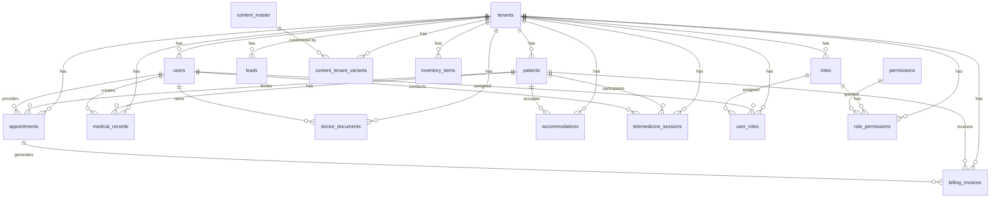

# Blink Eye Hospitals Database Schema

## Overview
This schema implements a tenant-based architecture for the Blink Eye Hospitals platform. All tenant-specific tables include a `tenant_id` column for data isolation. The schema uses PostgreSQL with row-level security (RLS) for enforcing tenant isolation.

## Data Isolation
- Every tenant-specific table has a `tenant_id` foreign key to `tenants.id`.
- Row-Level Security (RLS) policies ensure users can only access data for their tenant.
- All application queries must include `tenant_id` filters.

## RBAC Enforcement
- Users belong to tenants.
- Roles are tenant-specific.
- Permissions are global and assigned to roles.
- User-role assignments are tenant-specific.

## Scalability Aspects
- Tables are partitioned by `tenant_id` for horizontal scaling.
- Indexes on `tenant_id` and common query fields.
- Sharding strategy: Shard by tenant_id ranges or hash for even distribution.

## Tables

### Core Tables

#### tenants
```sql
CREATE TABLE tenants (
    id SERIAL PRIMARY KEY,
    name VARCHAR(255) NOT NULL,
    subdomain VARCHAR(100) UNIQUE NOT NULL,
    branding_config JSONB,
    status VARCHAR(20) DEFAULT 'active' CHECK (status IN ('active', 'inactive', 'suspended')),
    created_at TIMESTAMP DEFAULT CURRENT_TIMESTAMP,
    updated_at TIMESTAMP DEFAULT CURRENT_TIMESTAMP
);

-- Partition by range if needed, but for simplicity, not partitioned here
CREATE INDEX idx_tenants_subdomain ON tenants(subdomain);
```

#### users
```sql
CREATE TABLE users (
    id SERIAL PRIMARY KEY,
    tenant_id INTEGER NOT NULL REFERENCES tenants(id) ON DELETE CASCADE,
    email VARCHAR(255) UNIQUE NOT NULL,
    password_hash VARCHAR(255) NOT NULL,
    first_name VARCHAR(100),
    last_name VARCHAR(100),
    phone VARCHAR(20),
    is_active BOOLEAN DEFAULT TRUE,
    created_at TIMESTAMP DEFAULT CURRENT_TIMESTAMP,
    updated_at TIMESTAMP DEFAULT CURRENT_TIMESTAMP
);

-- Enable RLS
ALTER TABLE users ENABLE ROW LEVEL SECURITY;
CREATE POLICY users_tenant_isolation ON users USING (tenant_id = current_setting('app.current_tenant_id')::INTEGER);

CREATE INDEX idx_users_tenant_email ON users(tenant_id, email);
CREATE INDEX idx_users_email ON users(email);
```

#### roles
```sql
CREATE TABLE roles (
    id SERIAL PRIMARY KEY,
    tenant_id INTEGER NOT NULL REFERENCES tenants(id) ON DELETE CASCADE,
    name VARCHAR(100) NOT NULL,
    description TEXT,
    created_at TIMESTAMP DEFAULT CURRENT_TIMESTAMP,
    UNIQUE(tenant_id, name)
);

ALTER TABLE roles ENABLE ROW LEVEL SECURITY;
CREATE POLICY roles_tenant_isolation ON roles USING (tenant_id = current_setting('app.current_tenant_id')::INTEGER);

CREATE INDEX idx_roles_tenant_name ON roles(tenant_id, name);
```

#### permissions
Global permissions table.
```sql
CREATE TABLE permissions (
    id SERIAL PRIMARY KEY,
    name VARCHAR(100) UNIQUE NOT NULL,
    description TEXT,
    resource VARCHAR(100),
    action VARCHAR(50)
);

-- No tenant_id, global
CREATE INDEX idx_permissions_name ON permissions(name);
```

#### user_roles
Junction table for many-to-many.
```sql
CREATE TABLE user_roles (
    id SERIAL PRIMARY KEY,
    tenant_id INTEGER NOT NULL REFERENCES tenants(id) ON DELETE CASCADE,
    user_id INTEGER NOT NULL REFERENCES users(id) ON DELETE CASCADE,
    role_id INTEGER NOT NULL REFERENCES roles(id) ON DELETE CASCADE,
    assigned_at TIMESTAMP DEFAULT CURRENT_TIMESTAMP,
    UNIQUE(tenant_id, user_id, role_id)
);

ALTER TABLE user_roles ENABLE ROW LEVEL SECURITY;
CREATE POLICY user_roles_tenant_isolation ON user_roles USING (tenant_id = current_setting('app.current_tenant_id')::INTEGER);

CREATE INDEX idx_user_roles_tenant_user ON user_roles(tenant_id, user_id);
CREATE INDEX idx_user_roles_tenant_role ON user_roles(tenant_id, role_id);
```

#### role_permissions
Junction table.
```sql
CREATE TABLE role_permissions (
    id SERIAL PRIMARY KEY,
    tenant_id INTEGER NOT NULL REFERENCES tenants(id) ON DELETE CASCADE,
    role_id INTEGER NOT NULL REFERENCES roles(id) ON DELETE CASCADE,
    permission_id INTEGER NOT NULL REFERENCES permissions(id) ON DELETE CASCADE,
    UNIQUE(tenant_id, role_id, permission_id)
);

ALTER TABLE role_permissions ENABLE ROW LEVEL SECURITY;
CREATE POLICY role_permissions_tenant_isolation ON role_permissions USING (tenant_id = current_setting('app.current_tenant_id')::INTEGER);

CREATE INDEX idx_role_permissions_tenant_role ON role_permissions(tenant_id, role_id);
```

### Patient-Related Tables

#### patients
```sql
CREATE TABLE patients (
    id SERIAL PRIMARY KEY,
    tenant_id INTEGER NOT NULL REFERENCES tenants(id) ON DELETE CASCADE,
    first_name VARCHAR(100) NOT NULL,
    last_name VARCHAR(100) NOT NULL,
    date_of_birth DATE,
    gender VARCHAR(10) CHECK (gender IN ('male', 'female', 'other')),
    email VARCHAR(255),
    phone VARCHAR(20),
    address TEXT,
    medical_record_number VARCHAR(50) UNIQUE,
    created_at TIMESTAMP DEFAULT CURRENT_TIMESTAMP,
    updated_at TIMESTAMP DEFAULT CURRENT_TIMESTAMP
);

ALTER TABLE patients ENABLE ROW LEVEL SECURITY;
CREATE POLICY patients_tenant_isolation ON patients USING (tenant_id = current_setting('app.current_tenant_id')::INTEGER);

CREATE INDEX idx_patients_tenant_mrn ON patients(tenant_id, medical_record_number);
CREATE INDEX idx_patients_tenant_name ON patients(tenant_id, first_name, last_name);
```

#### appointments
```sql
CREATE TABLE appointments (
    id SERIAL PRIMARY KEY,
    tenant_id INTEGER NOT NULL REFERENCES tenants(id) ON DELETE CASCADE,
    patient_id INTEGER NOT NULL REFERENCES patients(id) ON DELETE CASCADE,
    doctor_id INTEGER NOT NULL REFERENCES users(id) ON DELETE CASCADE,
    appointment_date TIMESTAMP NOT NULL,
    duration_minutes INTEGER DEFAULT 30,
    status VARCHAR(20) DEFAULT 'scheduled' CHECK (status IN ('scheduled', 'confirmed', 'completed', 'cancelled', 'no_show')),
    notes TEXT,
    created_at TIMESTAMP DEFAULT CURRENT_TIMESTAMP,
    updated_at TIMESTAMP DEFAULT CURRENT_TIMESTAMP
);

ALTER TABLE appointments ENABLE ROW LEVEL SECURITY;
CREATE POLICY appointments_tenant_isolation ON appointments USING (tenant_id = current_setting('app.current_tenant_id')::INTEGER);

CREATE INDEX idx_appointments_tenant_date ON appointments(tenant_id, appointment_date);
CREATE INDEX idx_appointments_tenant_patient ON appointments(tenant_id, patient_id);
CREATE INDEX idx_appointments_tenant_doctor ON appointments(tenant_id, doctor_id);
```

#### medical_records (EHR)
```sql
CREATE TABLE medical_records (
    id SERIAL PRIMARY KEY,
    tenant_id INTEGER NOT NULL REFERENCES tenants(id) ON DELETE CASCADE,
    patient_id INTEGER NOT NULL REFERENCES patients(id) ON DELETE CASCADE,
    doctor_id INTEGER REFERENCES users(id),
    record_type VARCHAR(50) NOT NULL, -- e.g., 'consultation', 'test_result'
    record_date TIMESTAMP DEFAULT CURRENT_TIMESTAMP,
    diagnosis TEXT,
    treatment TEXT,
    notes TEXT,
    attachments JSONB, -- file paths or metadata
    created_at TIMESTAMP DEFAULT CURRENT_TIMESTAMP,
    updated_at TIMESTAMP DEFAULT CURRENT_TIMESTAMP
);

ALTER TABLE medical_records ENABLE ROW LEVEL SECURITY;
CREATE POLICY medical_records_tenant_isolation ON medical_records USING (tenant_id = current_setting('app.current_tenant_id')::INTEGER);

CREATE INDEX idx_medical_records_tenant_patient ON medical_records(tenant_id, patient_id);
CREATE INDEX idx_medical_records_tenant_date ON medical_records(tenant_id, record_date);
```

### Operational Tables

#### doctor_documents
```sql
CREATE TABLE doctor_documents (
    id SERIAL PRIMARY KEY,
    tenant_id INTEGER NOT NULL REFERENCES tenants(id) ON DELETE CASCADE,
    doctor_id INTEGER NOT NULL REFERENCES users(id) ON DELETE CASCADE,
    document_type VARCHAR(50) NOT NULL, -- e.g., 'license', 'certification'
    file_path VARCHAR(500) NOT NULL,
    expiry_date DATE,
    status VARCHAR(20) DEFAULT 'active' CHECK (status IN ('active', 'expired', 'revoked')),
    uploaded_at TIMESTAMP DEFAULT CURRENT_TIMESTAMP
);

ALTER TABLE doctor_documents ENABLE ROW LEVEL SECURITY;
CREATE POLICY doctor_documents_tenant_isolation ON doctor_documents USING (tenant_id = current_setting('app.current_tenant_id')::INTEGER);

CREATE INDEX idx_doctor_documents_tenant_doctor ON doctor_documents(tenant_id, doctor_id);
```

#### accommodations
Assuming for patient accommodations/stays.
```sql
CREATE TABLE accommodations (
    id SERIAL PRIMARY KEY,
    tenant_id INTEGER NOT NULL REFERENCES tenants(id) ON DELETE CASCADE,
    patient_id INTEGER NOT NULL REFERENCES patients(id) ON DELETE CASCADE,
    room_number VARCHAR(20) NOT NULL,
    bed_number VARCHAR(10),
    admission_date TIMESTAMP NOT NULL,
    discharge_date TIMESTAMP,
    status VARCHAR(20) DEFAULT 'occupied' CHECK (status IN ('occupied', 'available', 'maintenance')),
    notes TEXT,
    created_at TIMESTAMP DEFAULT CURRENT_TIMESTAMP,
    updated_at TIMESTAMP DEFAULT CURRENT_TIMESTAMP
);

ALTER TABLE accommodations ENABLE ROW LEVEL SECURITY;
CREATE POLICY accommodations_tenant_isolation ON accommodations USING (tenant_id = current_setting('app.current_tenant_id')::INTEGER);

CREATE INDEX idx_accommodations_tenant_room ON accommodations(tenant_id, room_number);
CREATE INDEX idx_accommodations_tenant_patient ON accommodations(tenant_id, patient_id);
```

#### leads
For marketing leads.
```sql
CREATE TABLE leads (
    id SERIAL PRIMARY KEY,
    tenant_id INTEGER NOT NULL REFERENCES tenants(id) ON DELETE CASCADE,
    first_name VARCHAR(100),
    last_name VARCHAR(100),
    email VARCHAR(255),
    phone VARCHAR(20),
    source VARCHAR(50), -- e.g., 'website', 'referral'
    status VARCHAR(20) DEFAULT 'new' CHECK (status IN ('new', 'contacted', 'qualified', 'converted', 'lost')),
    notes TEXT,
    created_at TIMESTAMP DEFAULT CURRENT_TIMESTAMP,
    updated_at TIMESTAMP DEFAULT CURRENT_TIMESTAMP
);

ALTER TABLE leads ENABLE ROW LEVEL SECURITY;
CREATE POLICY leads_tenant_isolation ON leads USING (tenant_id = current_setting('app.current_tenant_id')::INTEGER);

CREATE INDEX idx_leads_tenant_email ON leads(tenant_id, email);
CREATE INDEX idx_leads_tenant_status ON leads(tenant_id, status);
```

### Content Management Tables

#### content_master
Global content templates.
```sql
CREATE TABLE content_master (
    id SERIAL PRIMARY KEY,
    content_type VARCHAR(50) NOT NULL, -- e.g., 'email_template', 'page_content'
    title VARCHAR(255) NOT NULL,
    default_content TEXT,
    metadata JSONB,
    created_at TIMESTAMP DEFAULT CURRENT_TIMESTAMP,
    updated_at TIMESTAMP DEFAULT CURRENT_TIMESTAMP
);

-- No tenant_id, global
CREATE INDEX idx_content_master_type ON content_master(content_type);
```

#### content_tenant_variants
Tenant-specific customizations.
```sql
CREATE TABLE content_tenant_variants (
    id SERIAL PRIMARY KEY,
    tenant_id INTEGER NOT NULL REFERENCES tenants(id) ON DELETE CASCADE,
    content_master_id INTEGER NOT NULL REFERENCES content_master(id) ON DELETE CASCADE,
    customized_content TEXT,
    is_active BOOLEAN DEFAULT TRUE,
    created_at TIMESTAMP DEFAULT CURRENT_TIMESTAMP,
    updated_at TIMESTAMP DEFAULT CURRENT_TIMESTAMP,
    UNIQUE(tenant_id, content_master_id)
);

ALTER TABLE content_tenant_variants ENABLE ROW LEVEL SECURITY;
CREATE POLICY content_tenant_variants_tenant_isolation ON content_tenant_variants USING (tenant_id = current_setting('app.current_tenant_id')::INTEGER);

CREATE INDEX idx_content_tenant_variants_tenant_master ON content_tenant_variants(tenant_id, content_master_id);
```

### Additional Feature Tables

#### billing_invoices
```sql
CREATE TABLE billing_invoices (
    id SERIAL PRIMARY KEY,
    tenant_id INTEGER NOT NULL REFERENCES tenants(id) ON DELETE CASCADE,
    patient_id INTEGER NOT NULL REFERENCES patients(id) ON DELETE CASCADE,
    appointment_id INTEGER REFERENCES appointments(id),
    total_amount DECIMAL(10,2) NOT NULL,
    paid_amount DECIMAL(10,2) DEFAULT 0,
    status VARCHAR(20) DEFAULT 'unpaid' CHECK (status IN ('unpaid', 'partially_paid', 'paid', 'overdue')),
    due_date DATE,
    created_at TIMESTAMP DEFAULT CURRENT_TIMESTAMP,
    updated_at TIMESTAMP DEFAULT CURRENT_TIMESTAMP
);

ALTER TABLE billing_invoices ENABLE ROW LEVEL SECURITY;
CREATE POLICY billing_invoices_tenant_isolation ON billing_invoices USING (tenant_id = current_setting('app.current_tenant_id')::INTEGER);

CREATE INDEX idx_billing_invoices_tenant_patient ON billing_invoices(tenant_id, patient_id);
CREATE INDEX idx_billing_invoices_tenant_status ON billing_invoices(tenant_id, status);
```

#### inventory_items
```sql
CREATE TABLE inventory_items (
    id SERIAL PRIMARY KEY,
    tenant_id INTEGER NOT NULL REFERENCES tenants(id) ON DELETE CASCADE,
    name VARCHAR(255) NOT NULL,
    category VARCHAR(100),
    quantity INTEGER NOT NULL DEFAULT 0,
    unit_cost DECIMAL(10,2),
    supplier VARCHAR(255),
    expiry_date DATE,
    location VARCHAR(100),
    created_at TIMESTAMP DEFAULT CURRENT_TIMESTAMP,
    updated_at TIMESTAMP DEFAULT CURRENT_TIMESTAMP
);

ALTER TABLE inventory_items ENABLE ROW LEVEL SECURITY;
CREATE POLICY inventory_items_tenant_isolation ON inventory_items USING (tenant_id = current_setting('app.current_tenant_id')::INTEGER);

CREATE INDEX idx_inventory_items_tenant_category ON inventory_items(tenant_id, category);
CREATE INDEX idx_inventory_items_tenant_name ON inventory_items(tenant_id, name);
```

#### telemedicine_sessions
```sql
CREATE TABLE telemedicine_sessions (
    id SERIAL PRIMARY KEY,
    tenant_id INTEGER NOT NULL REFERENCES tenants(id) ON DELETE CASCADE,
    patient_id INTEGER NOT NULL REFERENCES patients(id) ON DELETE CASCADE,
    doctor_id INTEGER NOT NULL REFERENCES users(id) ON DELETE CASCADE,
    session_date TIMESTAMP NOT NULL,
    duration_minutes INTEGER,
    status VARCHAR(20) DEFAULT 'scheduled' CHECK (status IN ('scheduled', 'in_progress', 'completed', 'cancelled')),
    recording_url VARCHAR(500),
    notes TEXT,
    created_at TIMESTAMP DEFAULT CURRENT_TIMESTAMP,
    updated_at TIMESTAMP DEFAULT CURRENT_TIMESTAMP
);

ALTER TABLE telemedicine_sessions ENABLE ROW LEVEL SECURITY;
CREATE POLICY telemedicine_sessions_tenant_isolation ON telemedicine_sessions USING (tenant_id = current_setting('app.current_tenant_id')::INTEGER);

CREATE INDEX idx_telemedicine_sessions_tenant_date ON telemedicine_sessions(tenant_id, session_date);
CREATE INDEX idx_telemedicine_sessions_tenant_patient ON telemedicine_sessions(tenant_id, patient_id);
```

## ERD Diagram



## Notes
- All tenant-specific tables have RLS enabled with policies filtering on `tenant_id`.
- Indexes are created on tenant_id and key fields for performance.
- For production, consider partitioning tables by tenant_id for better scalability.
- Sharding can be implemented at the database level by tenant_id ranges.