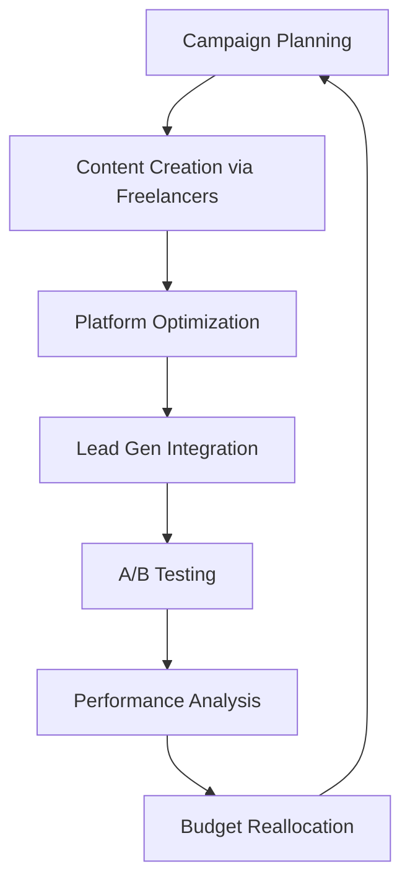
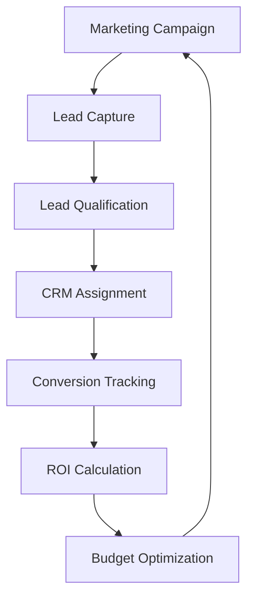

# Digital Marketing Strategy for Blink Eye Hospitals Platform

## Overview

This comprehensive digital marketing strategy for the Blink Eye Hospitals platform leverages data-driven insights from the [Analytics & Intelligence Layer](analytics_intelligence_layer.md) and integrates seamlessly with the [Lead Generation Engine](lead_generation_engine.md). The strategy focuses on acquiring qualified leads for eye care services through optimized channel allocation, targeted campaigns, and measurable ROI tracking.

## Data-Driven Spend Allocation

Based on analytics from the platform's intelligence layer, marketing spend is allocated across channels according to historical performance metrics, conversion rates, and predictive modeling. The allocation prioritizes channels with the highest lead quality and lowest cost per acquisition.

### Channel Performance Analysis

Using data from `analytics_metrics` and `lead_campaigns` tables:

- **Google Ads**: 35% allocation (highest conversion rate for intent-driven searches like "eye specialist near me")
- **Social Media (Facebook/Instagram)**: 30% allocation (strong engagement with visual content and local targeting)
- **SEO/Content Marketing**: 20% allocation (sustained organic traffic growth, per [SEO Strategy](seo_ai_compliance_strategy.md))
- **Email Marketing**: 10% allocation (high conversion from nurtured leads)
- **Partnerships/Referrals**: 5% allocation (cost-effective through existing networks)

### Budget Allocation Framework

| Channel | Monthly Budget | Rationale | KPIs |
|---------|----------------|-----------|------|
| Google Ads | $10,000 | High intent traffic, measurable ROI | CPC < $2, Conversion Rate > 3% |
| Social Media | $8,000 | Visual storytelling aligns with eye care | Engagement Rate > 5%, Lead Cost < $15 |
| SEO | $5,000 | Long-term organic growth | Organic Traffic Growth > 20%/month |
| Email | $3,000 | Nurture existing leads | Open Rate > 25%, Click Rate > 5% |
| Partnerships | $1,000 | Leverage hospital networks | Referral Conversion > 15% |

Total Monthly Budget: $27,000 (scalable based on hospital size)

## Campaign Ideas

### Reels and Video Content Strategy

Leveraging short-form video for maximum engagement on social platforms:

1. **Educational Reels Series**: 15-second videos explaining common eye conditions (e.g., "What is Cataract?") featuring animated graphics and doctor cameos. Target: Awareness stage leads.

2. **Doctor Spotlight Reels**: Behind-the-scenes videos of ophthalmologists performing procedures or sharing success stories. Include calls-to-action for appointments.

3. **Patient Testimonial Videos**: Short clips of anonymized patient journeys from diagnosis to recovery. Focus on emotional storytelling to build trust.

4. **Quick Tip Reels**: Daily eye health tips (e.g., "Protect Your Eyes from Screen Time") to establish thought leadership.

### Freelancer Ad Creation

Utilize freelance platforms for cost-effective, specialized ad production:

1. **Custom Video Ads**: Hire video freelancers for 30-60 second ads showcasing hospital facilities, doctor expertise, and patient testimonials. Budget: $500-1,000 per ad.

2. **Animated Explainer Videos**: Commission freelancers for medical animations explaining complex procedures like LASIK or retinal surgery.

3. **Social Media Ad Sets**: Create carousel ads, stories, and reels optimized for different platforms using freelance designers.

4. **Localized Content**: Hire local freelancers for region-specific ads incorporating cultural nuances and language preferences.

### Campaign Execution Workflow



## Budget Recommendations

### Annual Budget Breakdown

- **Q1 (Launch Phase)**: $200,000 - Focus on brand awareness and lead capture setup
- **Q2-Q3 (Growth Phase)**: $300,000/month - Scale successful campaigns
- **Q4 (Optimization Phase)**: $250,000/month - Refine based on data

### Cost Optimization Strategies

1. **Performance-Based Scaling**: Increase budget for channels showing >15% month-over-month lead growth
2. **Seasonal Adjustments**: Boost social media spend during eye health awareness months (e.g., February for AMD awareness)
3. **A/B Testing Budget**: Allocate 10% of total budget for testing new ad creatives and targeting options

### Freelancer Budget Allocation

- Video Production: $50,000/year (outsourced to maintain quality and reduce internal costs)
- Graphic Design: $20,000/year (for ad creatives and social media assets)
- Copywriting: $15,000/year (specialized medical content)

## Tracking Paid Amounts and Status

### Campaign Tracking System

Integrate with `lead_campaigns` table to monitor:

```sql
-- Example tracking query
SELECT campaign_name, budget, spent_amount, status,
       leads_generated, conversions
FROM lead_campaigns
WHERE tenant_id = current_tenant_id()
ORDER BY created_at DESC;
```

### Status Tracking Workflow

1. **Pre-Launch**: Budget approval and freelancer contracts
2. **Active**: Real-time spend monitoring via platform APIs
3. **Paused/Completed**: Automatic status updates based on budget thresholds
4. **Audit**: Monthly reconciliation of actual vs. planned spend

### Payment Tracking Integration

- Link campaign spend to `lead_interactions` for attribution
- Automated alerts when 80% of budget is reached
- Integration with accounting systems for expense reporting

## ROI Analysis

### Key Metrics Framework

Using analytics from the intelligence layer:

- **Cost per Lead (CPL)**: Total spend / qualified leads
- **Cost per Conversion**: Total spend / patient appointments
- **Customer Lifetime Value (CLV)**: Average revenue per patient over time
- **ROI Formula**: (Revenue from conversions - Marketing spend) / Marketing spend * 100

### Predictive ROI Modeling

Leverage `predictive_models` for forecasting:

- Appointment no-show predictions to optimize ad timing
- Lead quality scoring to focus spend on high-value segments
- Revenue forecasting based on marketing attribution

### Quarterly ROI Targets

- **Q1**: Break-even (ROI = 100%)
- **Q2**: 150% ROI through optimized targeting
- **Q3**: 200% ROI with refined creative and automation
- **Q4**: 250% ROI through predictive optimization

### Attribution Modeling

Multi-touch attribution using lead generation engine:

- First-touch: Initial campaign that introduced the lead
- Last-touch: Campaign that drove the conversion
- Multi-touch: Weighted credit across all touchpoints

## Integration with Lead Generation Engine

### Seamless Campaign-to-Lead Flow

1. **Campaign Tagging**: All marketing efforts tagged with UTM parameters for source tracking
2. **Lead Scoring**: AI-powered scoring based on campaign source and engagement
3. **Automated Routing**: High-quality leads from paid campaigns routed to priority CRM agents
4. **Conversion Tracking**: Real-time updates to `leads` table with campaign attribution

### API Integration Points

- **Campaign Creation**: POST to `/api/v1/campaigns` with budget and targeting
- **Lead Attribution**: Webhooks for new leads with campaign metadata
- **Performance Sync**: Daily sync of campaign metrics to analytics layer

### Workflow Integration



This strategy ensures data-driven marketing that maximizes lead quality and ROI while maintaining compliance with healthcare regulations as outlined in the [SEO and Compliance Strategy](seo_ai_compliance_strategy.md).