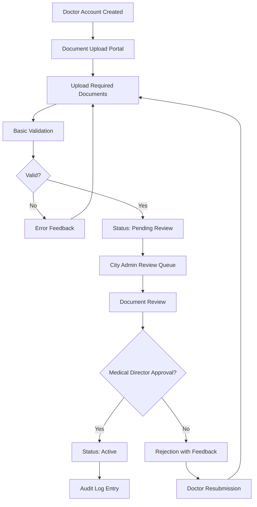
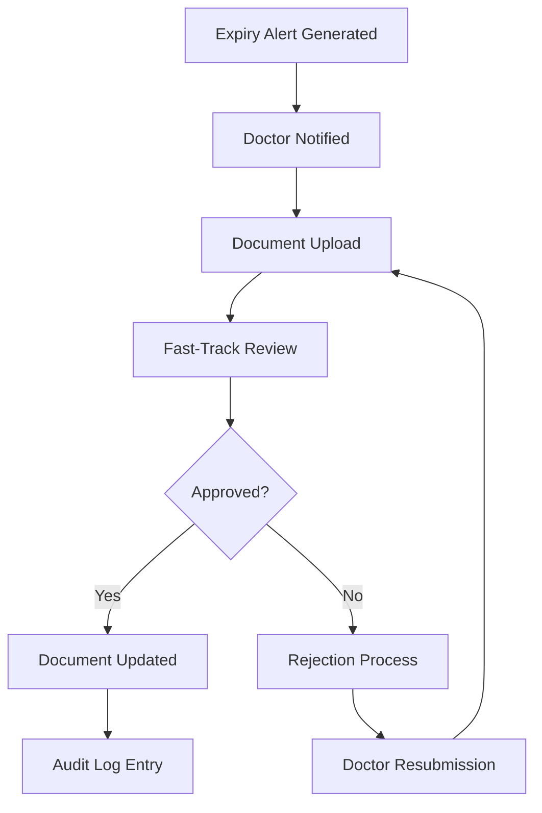

# Doctor Document Store Module

## Purpose
The Doctor Document Store module manages the secure storage, verification, and lifecycle management of medical credentials and professional documents for healthcare providers. It ensures compliance with regulatory requirements by maintaining verifiable records of doctor qualifications, licenses, certifications, and continuing education credentials. The module supports the verification workflow required for doctor onboarding and credential maintenance within the Blink Eye Hospitals platform.

## Features

### Document Management
- **Secure Upload**: Encrypted file upload with support for multiple document types (PDF, images, scanned documents)
- **Document Classification**: Categorization by type (license, certification, diploma, training certificates)
- **Version Control**: Track document versions with audit trails for changes
- **Expiry Tracking**: Automated alerts for expiring documents (30, 14, 7 days before expiry)
- **Status Management**: Active, expired, revoked, pending verification statuses

### Verification Workflow
- **Automated Validation**: Basic document validation (file type, size limits)
- **Review Queue**: Dashboard for administrators to review pending documents
- **Approval Process**: Multi-level approval (City Admin → Medical Director)
- **Rejection Handling**: Feedback mechanism for document resubmissions
- **Audit Logging**: Complete audit trail of all verification actions

### Compliance Features
- **Regulatory Compliance**: Support for HIPAA, GDPR, and local healthcare regulations
- **Retention Policies**: Configurable document retention periods
- **Digital Signatures**: Integration with digital signature services for authenticity
- **Blockchain Verification**: Optional blockchain-based document verification for high-security requirements

### Integration Capabilities
- **Third-Party Verification**: API integrations with medical board databases
- **Automated Renewal**: Integration with certification bodies for renewal tracking
- **Bulk Operations**: Batch upload and verification for large medical groups

## Database Tables

### doctor_documents
```sql
CREATE TABLE doctor_documents (
    id SERIAL PRIMARY KEY,
    tenant_id INTEGER NOT NULL REFERENCES tenants(id) ON DELETE CASCADE,
    doctor_id INTEGER NOT NULL REFERENCES users(id) ON DELETE CASCADE,
    document_type VARCHAR(50) NOT NULL, -- e.g., 'license', 'certification'
    file_path VARCHAR(500) NOT NULL,
    expiry_date DATE,
    status VARCHAR(20) DEFAULT 'active' CHECK (status IN ('active', 'expired', 'revoked')),
    uploaded_at TIMESTAMP DEFAULT CURRENT_TIMESTAMP
);

ALTER TABLE doctor_documents ENABLE ROW LEVEL SECURITY;
CREATE POLICY doctor_documents_tenant_isolation ON doctor_documents USING (tenant_id = current_setting('app.current_tenant_id')::INTEGER);

CREATE INDEX idx_doctor_documents_tenant_doctor ON doctor_documents(tenant_id, doctor_id);
```

**Key Fields**:
- `tenant_id`: Ensures tenant isolation
- `doctor_id`: Links to the doctor user account
- `document_type`: Categorizes the document (license, certification, etc.)
- `file_path`: Secure storage path for the document file
- `expiry_date`: Critical for compliance tracking
- `status`: Current verification status

## Workflows

### Doctor Onboarding Workflow


**Process Steps**:
1. Doctor registers and accesses document upload portal
2. Uploads required credentials (license, certifications, etc.)
3. System performs basic validation (file type, size, format)
4. Documents enter review queue for City Admin
5. City Admin reviews and forwards to Medical Director if needed
6. Medical Director provides final approval
7. Approved documents marked as active; doctor gains full clinical permissions
8. All actions logged in audit trail

### Document Renewal Workflow


**Process Steps**:
1. System monitors expiry dates and sends alerts
2. Doctor uploads renewed documents
3. Fast-track review process for existing verified doctors
4. Updated documents replace previous versions
5. Audit trail maintained for compliance

## User Interactions

### For Doctors
- **Document Upload Interface**: Drag-and-drop file upload with progress indicators
- **Document Dashboard**: View all uploaded documents with status and expiry dates
- **Expiry Alerts**: Email and in-app notifications for upcoming expirations
- **Resubmission Portal**: Easy interface for correcting rejected documents
- **Document Viewer**: Secure viewing of uploaded documents

### For Administrators (City Admin/Medical Director)
- **Review Dashboard**: Queue of pending documents with filtering and search
- **Document Viewer**: Secure viewing with zoom and download capabilities
- **Approval Interface**: One-click approval/rejection with comments
- **Bulk Actions**: Approve multiple documents simultaneously
- **Reporting**: Analytics on verification throughput and pending items

### For System Administrators
- **Configuration Portal**: Set document requirements per specialty
- **Retention Settings**: Configure automatic deletion policies
- **Integration Management**: Configure third-party verification services

## API Endpoints

### Document Management Endpoints
- `POST /api/v1/doctors/{doctor_id}/documents` - Upload new document
- `GET /api/v1/doctors/{doctor_id}/documents` - List doctor's documents
- `GET /api/v1/doctors/{doctor_id}/documents/{document_id}` - Get specific document details
- `PUT /api/v1/doctors/{doctor_id}/documents/{document_id}` - Update document metadata
- `DELETE /api/v1/doctors/{doctor_id}/documents/{document_id}` - Delete document

### Review and Approval Endpoints
- `GET /api/v1/admin/documents/pending` - Get pending review queue
- `POST /api/v1/admin/documents/{document_id}/review` - Submit review decision
- `GET /api/v1/admin/documents/expired` - Get expiring documents report

### Bulk Operations Endpoints
- `POST /api/v1/admin/documents/bulk-approve` - Bulk approval of documents
- `POST /api/v1/admin/documents/bulk-reject` - Bulk rejection with feedback

**Authentication**: All endpoints require JWT authentication with tenant context
**Authorization**: Role-based permissions enforced (doctors can only access their own documents)
**Rate Limiting**: Upload endpoints limited to prevent abuse
**File Handling**: Secure file storage with CDN integration for performance

## Integration Points

### Internal Integrations
- **User Management**: Links to `users` table for doctor profiles
- **RBAC System**: Permissions control access (`users:update` for document management)
- **Audit Logging**: All document operations logged in audit trails
- **Notification System**: Email/SMS alerts for expiry and status changes

### External Integrations
- **Medical Board APIs**: Real-time verification against official databases
- **Digital Signature Services**: DocuSign, Adobe Sign for document authenticity
- **Cloud Storage**: AWS S3, Google Cloud Storage for secure file storage
- **OCR Services**: Extract text from scanned documents for validation
- **Blockchain Services**: Immutable document verification for high-stakes credentials

### Workflow Integrations
- **Appointment System**: Verified doctors only can schedule appointments
- **EHR System**: Document verification status affects medical record access
- **Billing System**: Credential verification required for insurance claims
- **Reporting Dashboard**: Document verification metrics included in compliance reports

## Security Considerations
- **Encryption**: Documents encrypted at rest and in transit
- **Access Control**: Strict RBAC with document-level permissions
- **Audit Trails**: Comprehensive logging of all access and modifications
- **Data Retention**: Configurable retention policies with secure deletion
- **Compliance**: HIPAA/GDPR compliant with data minimization principles

## Performance Optimization
- **CDN Integration**: Fast document delivery globally
- **Lazy Loading**: Efficient handling of large document lists
- **Caching**: Metadata caching to reduce database queries
- **Background Processing**: Asynchronous document processing for uploads

## Monitoring and Analytics
- **Verification Metrics**: Track approval rates, processing times, rejection reasons
- **Compliance Dashboard**: Real-time view of expiring documents across the tenant
- **Audit Reports**: Generate compliance reports for regulatory bodies
- **Performance Monitoring**: Track system performance and identify bottlenecks