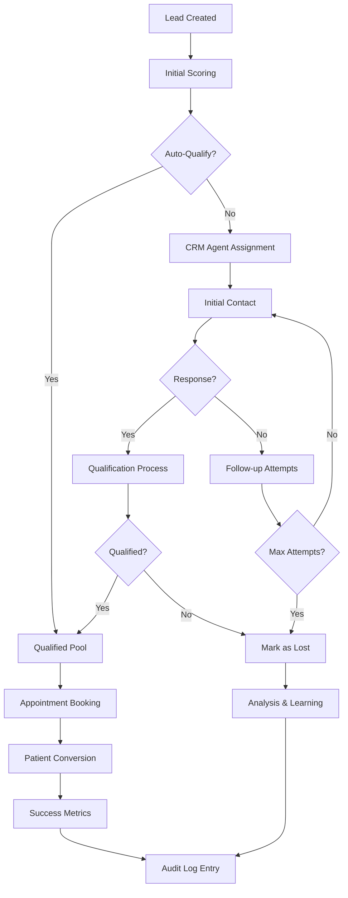
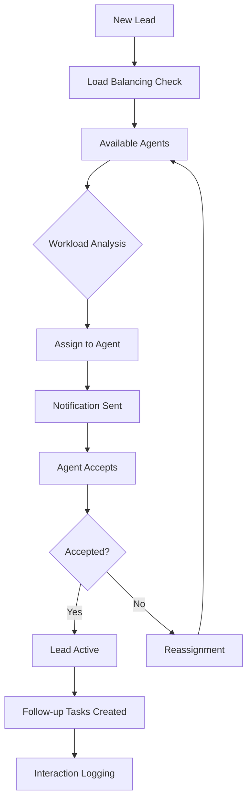

# Lead Generation Engine Module

## Purpose
The Lead Generation Engine module automates the capture, qualification, and conversion of potential patients into the Blink Eye Hospitals platform. It provides a comprehensive CRM system that manages the entire patient acquisition lifecycle from initial inquiry to conversion, enabling hospitals to efficiently nurture leads and optimize marketing efforts. The module integrates multiple lead sources and provides intelligent routing and follow-up mechanisms.

## Features

### Lead Capture and Sources
- **Multi-Channel Capture**: Website forms, social media, referrals, events, partnerships
- **API Integration**: Third-party lead providers and marketing platforms
- **Automated Deduplication**: Prevent duplicate leads and merge similar entries
- **Lead Scoring**: Intelligent scoring based on demographics, source, and behavior

### Lead Qualification and Routing
- **Automated Qualification**: Rule-based assessment of lead quality and readiness
- **Intelligent Assignment**: Smart routing to appropriate CRM agents based on workload and expertise
- **Lead Nurturing**: Automated email sequences and follow-up campaigns
- **Priority Management**: High-value leads flagged for immediate attention

### Conversion Tracking
- **Conversion Funnel**: Track leads through awareness → interest → decision → action stages
- **Attribution Modeling**: Credit conversion to specific marketing channels and campaigns
- **ROI Measurement**: Calculate return on investment for lead generation activities
- **Performance Analytics**: Detailed reporting on lead quality and conversion rates

### CRM Functionality
- **Contact Management**: Comprehensive lead profiles with interaction history
- **Communication Tracking**: Log all interactions (calls, emails, meetings)
- **Task Management**: Assign follow-up tasks and set reminders
- **Pipeline Visualization**: Kanban-style lead pipeline with drag-and-drop management

### Integration Capabilities
- **Marketing Automation**: Connect with email marketing and CRM platforms
- **Telephony Integration**: Click-to-call functionality and call logging
- **Calendar Sync**: Schedule appointments directly from lead management
- **Document Management**: Attach lead-related documents and proposals

## Database Tables

### leads
```sql
CREATE TABLE leads (
    id SERIAL PRIMARY KEY,
    tenant_id INTEGER NOT NULL REFERENCES tenants(id) ON DELETE CASCADE,
    first_name VARCHAR(100),
    last_name VARCHAR(100),
    email VARCHAR(255),
    phone VARCHAR(20),
    source VARCHAR(50), -- e.g., 'website', 'referral'
    status VARCHAR(20) DEFAULT 'new' CHECK (status IN ('new', 'contacted', 'qualified', 'converted', 'lost')),
    notes TEXT,
    created_at TIMESTAMP DEFAULT CURRENT_TIMESTAMP,
    updated_at TIMESTAMP DEFAULT CURRENT_TIMESTAMP
);

ALTER TABLE leads ENABLE ROW LEVEL SECURITY;
CREATE POLICY leads_tenant_isolation ON leads USING (tenant_id = current_setting('app.current_tenant_id')::INTEGER);

CREATE INDEX idx_leads_tenant_email ON leads(tenant_id, email);
CREATE INDEX idx_leads_tenant_status ON leads(tenant_id, status);
```

### lead_interactions
```sql
CREATE TABLE lead_interactions (
    id SERIAL PRIMARY KEY,
    tenant_id INTEGER NOT NULL REFERENCES tenants(id) ON DELETE CASCADE,
    lead_id INTEGER NOT NULL REFERENCES leads(id) ON DELETE CASCADE,
    interaction_type VARCHAR(50) NOT NULL, -- 'call', 'email', 'meeting'
    agent_id INTEGER NOT NULL REFERENCES users(id) ON DELETE CASCADE,
    notes TEXT,
    outcome VARCHAR(100),
    scheduled_at TIMESTAMP,
    completed_at TIMESTAMP,
    created_at TIMESTAMP DEFAULT CURRENT_TIMESTAMP
);

ALTER TABLE lead_interactions ENABLE ROW LEVEL SECURITY;
CREATE POLICY lead_interactions_tenant_isolation ON lead_interactions USING (tenant_id = current_setting('app.current_tenant_id')::INTEGER);

CREATE INDEX idx_lead_interactions_tenant_lead ON lead_interactions(tenant_id, lead_id);
CREATE INDEX idx_lead_interactions_tenant_agent ON lead_interactions(tenant_id, agent_id);
```

### lead_campaigns
```sql
CREATE TABLE lead_campaigns (
    id SERIAL PRIMARY KEY,
    tenant_id INTEGER NOT NULL REFERENCES tenants(id) ON DELETE CASCADE,
    campaign_name VARCHAR(255) NOT NULL,
    source_type VARCHAR(50) NOT NULL, -- 'email', 'social', 'event'
    target_audience JSONB,
    budget DECIMAL(10,2),
    start_date DATE,
    end_date DATE,
    status VARCHAR(20) DEFAULT 'active' CHECK (status IN ('active', 'paused', 'completed')),
    created_at TIMESTAMP DEFAULT CURRENT_TIMESTAMP,
    updated_at TIMESTAMP DEFAULT CURRENT_TIMESTAMP
);

ALTER TABLE lead_campaigns ENABLE ROW LEVEL SECURITY;
CREATE POLICY lead_campaigns_tenant_isolation ON lead_campaigns USING (tenant_id = current_setting('app.current_tenant_id')::INTEGER);

CREATE INDEX idx_lead_campaigns_tenant_status ON lead_campaigns(tenant_id, status);
```

**Key Relationships**:
- `leads` stores basic lead information and status
- `lead_interactions` tracks all communications and activities
- `lead_campaigns` manages marketing campaigns and their performance

## Workflows

### Lead Qualification and Conversion Workflow


**Process Steps**:
1. Lead enters system through various capture channels
2. Automatic scoring based on predefined criteria
3. High-quality leads auto-qualify; others assigned to agents
4. CRM agents initiate contact and gather more information
5. Qualification assessment based on medical needs and readiness
6. Qualified leads move to conversion pipeline
7. Schedule appointments and complete patient registration
8. Track conversion metrics and update lead status
9. All activities logged for audit and analytics

### Lead Assignment Workflow


**Process Steps**:
1. New lead triggers assignment algorithm
2. System analyzes current agent workloads and availability
3. Selects optimal agent based on expertise and capacity
4. Sends notification to assigned agent
5. Agent reviews and accepts assignment
6. If declined, lead reassigned to next available agent
7. Active leads generate automated follow-up tasks
8. All interactions tracked in lead history

## User Interactions

### For CRM Agents
- **Lead Dashboard**: Overview of assigned leads with status indicators
- **Lead Details View**: Comprehensive lead profile with interaction history
- **Communication Tools**: Integrated email, phone, and task management
- **Qualification Forms**: Structured assessment tools for lead evaluation
- **Pipeline Management**: Drag-and-drop interface for status updates
- **Reporting Tools**: Personal and team performance metrics

### For Administrators (City Admin/CRM Manager)
- **Team Dashboard**: Monitor agent performance and lead distribution
- **Campaign Management**: Create and track marketing campaigns
- **Analytics Portal**: Conversion rates, source effectiveness, ROI analysis
- **Assignment Rules**: Configure automated lead routing logic
- **Quality Assurance**: Review agent interactions and provide coaching

### For Marketing Team
- **Campaign Builder**: Design lead generation campaigns
- **Lead Scoring Rules**: Define qualification criteria and scoring algorithms
- **Integration Setup**: Connect external marketing platforms and APIs
- **Performance Reports**: Track campaign effectiveness and optimize strategies

## API Endpoints

### Lead Management Endpoints
- `POST /api/v1/leads` - Create new lead
- `GET /api/v1/leads` - List leads with filtering
- `GET /api/v1/leads/{id}` - Get lead details
- `PUT /api/v1/leads/{id}` - Update lead information
- `POST /api/v1/leads/{id}/convert` - Convert lead to patient

### Interaction Endpoints
- `POST /api/v1/leads/{id}/interactions` - Log new interaction
- `GET /api/v1/leads/{id}/interactions` - Get interaction history
- `PUT /api/v1/interactions/{id}` - Update interaction details

### Campaign Endpoints
- `POST /api/v1/campaigns` - Create marketing campaign
- `GET /api/v1/campaigns/{id}/leads` - Get leads from specific campaign
- `POST /api/v1/campaigns/{id}/analytics` - Generate campaign report

**Authentication**: JWT with tenant context and role validation
**Rate Limiting**: Lead creation endpoints protected against spam
**Webhooks**: Real-time notifications for lead status changes

## Integration Points

### Internal Integrations
- **Patient Management**: Seamless conversion of leads to patient records
- **Appointment System**: Direct booking from lead management interface
- **Content System**: Automated nurturing emails and communications
- **Analytics Layer**: Lead performance metrics and conversion tracking

### External Integrations
- **Marketing Platforms**: HubSpot, Marketo for advanced lead nurturing
- **Social Media**: Facebook Lead Ads, LinkedIn campaign integration
- **Email Services**: SendGrid, Mailchimp for automated communications
- **Telephony**: Twilio, Nexmo for call tracking and click-to-call
- **Web Analytics**: Google Analytics for lead source attribution

### Workflow Integrations
- **Lead Scoring Engine**: Machine learning models for lead quality prediction
- **Calendar Systems**: Outlook, Google Calendar for meeting scheduling
- **CRM Platforms**: Salesforce, Zoho CRM for enterprise integrations
- **Payment Systems**: Process deposits and consultation fees during conversion

## Security Considerations
- **Data Privacy**: GDPR/CCPA compliance for lead information
- **Consent Management**: Track marketing consent and preferences
- **Access Control**: Role-based permissions for lead data access
- **Audit Trails**: Complete logging of all lead interactions

## Performance Optimization
- **Database Sharding**: Partition lead data by tenant for scalability
- **Caching**: Frequently accessed lead data cached for fast retrieval
- **Background Processing**: Asynchronous lead scoring and assignment
- **Real-time Sync**: WebSocket connections for live dashboard updates

## Monitoring and Analytics
- **Lead Metrics**: Conversion rates, source performance, time-to-conversion
- **Agent Performance**: Activity logs, conversion success rates, response times
- **Campaign ROI**: Cost per lead, cost per conversion, lifetime value
- **Predictive Analytics**: Lead scoring models and churn prediction