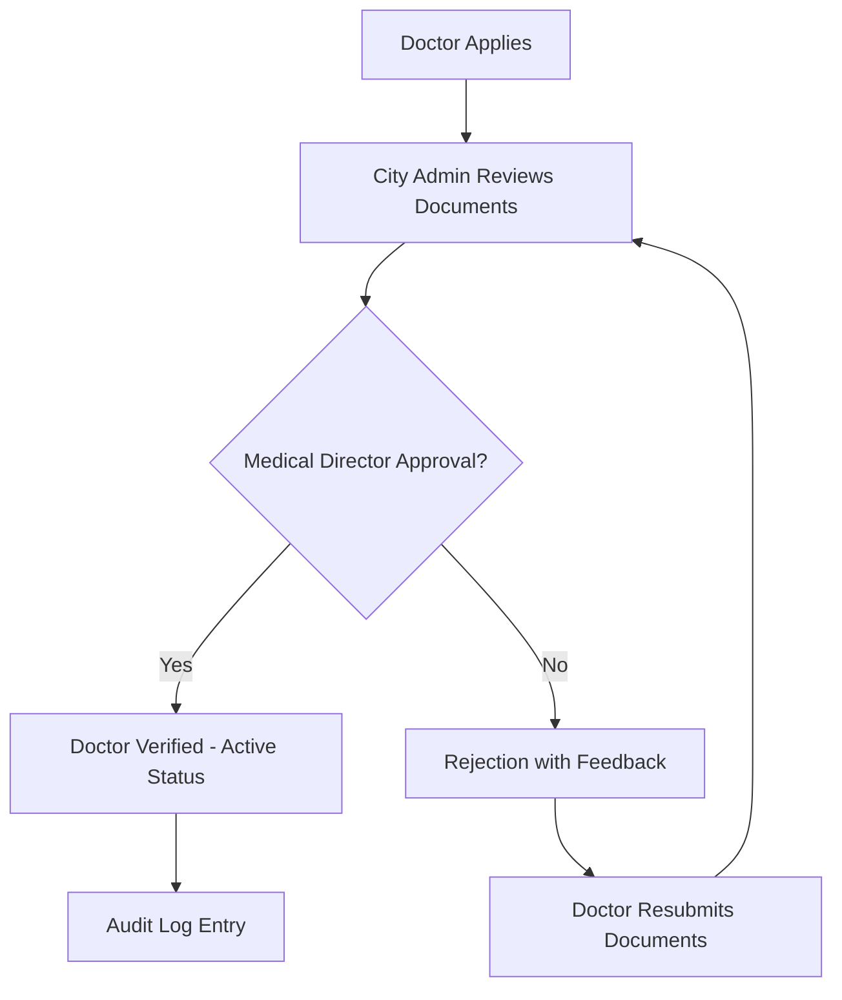
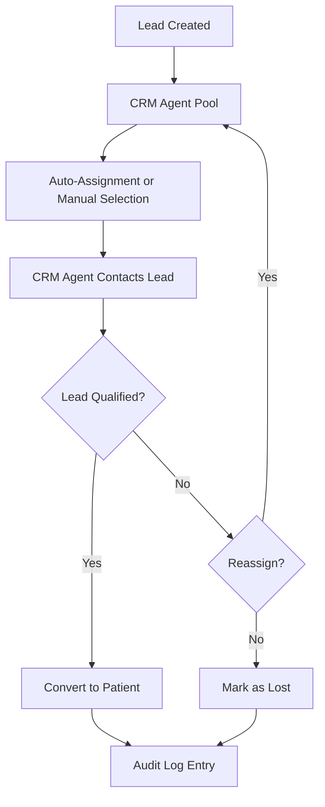
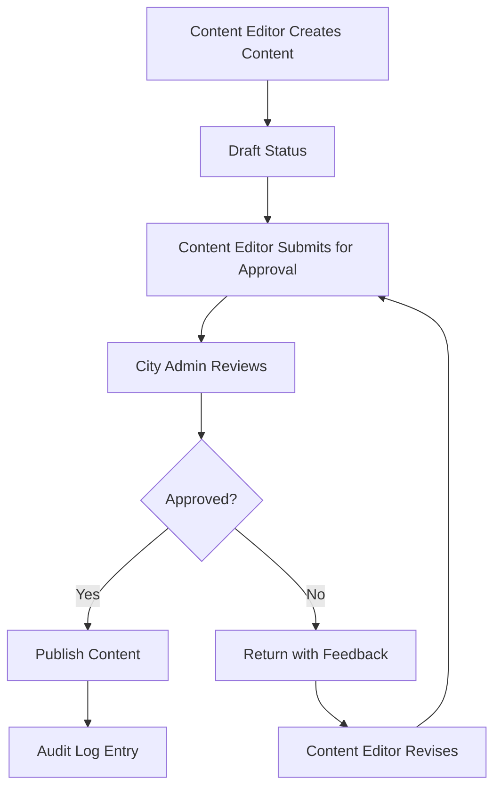
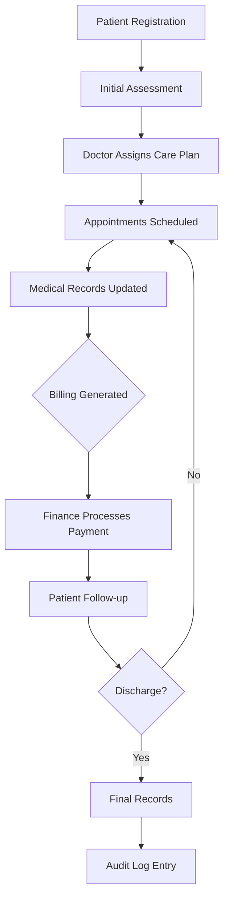

# RBAC System Design for Blink Eye Hospitals Platform

## Overview

This document defines the Role-Based Access Control (RBAC) system for the Blink Eye Hospitals platform, including user roles, permissions, workflows, and architectural considerations. The system supports multi-role assignments, tenant-specific and global scopes, audit trails, and hierarchical permissions.

## User Roles

### Super Admin
- **Scope**: Global
- **Description**: System-wide administrator with full access to all tenants, platform settings, and infrastructure. Responsible for tenant onboarding, system maintenance, and global policy enforcement.
- **Multi-Role Capability**: Can hold additional tenant-specific roles if needed.

### Medical Director
- **Scope**: Tenant-specific
- **Description**: Senior medical leadership role overseeing clinical operations, quality assurance, and medical staff management within a hospital tenant.
- **Multi-Role Capability**: Can combine with Doctor role for hands-on clinical work.

### City Admin
- **Scope**: Tenant-specific (can manage multiple related tenants if configured)
- **Description**: Administrative role managing operational aspects of hospital(s), including staff coordination, resource allocation, and local policy implementation.
- **Multi-Role Capability**: Can hold Finance or CRM roles for comprehensive oversight.

### Doctor
- **Scope**: Tenant-specific
- **Description**: Clinical practitioner with access to patient records, appointment management, and medical documentation.
- **Multi-Role Capability**: Can be combined with Medical Director for leadership responsibilities.

### Content Editor
- **Scope**: Tenant-specific
- **Description**: Manages hospital-specific content, including website content, email templates, and patient communications.
- **Multi-Role Capability**: Limited; primarily focused on content management.

### CRM Agent
- **Scope**: Tenant-specific
- **Description**: Handles lead management, patient outreach, and customer relationship activities.
- **Multi-Role Capability**: Can combine with City Admin for operational coordination.

### Finance
- **Scope**: Tenant-specific
- **Description**: Manages billing, invoicing, financial reporting, and payment processing.
- **Multi-Role Capability**: Can combine with City Admin for administrative oversight.

## Permission Hierarchies

Permissions are organized in a hierarchical structure where higher-level roles inherit permissions from lower-level roles:

```
Super Admin (Global)
├── Medical Director (Tenant)
│   ├── City Admin (Tenant)
│   │   ├── Doctor (Tenant)
│   │   ├── Content Editor (Tenant)
│   │   ├── CRM Agent (Tenant)
│   │   └── Finance (Tenant)
```

- **Inheritance Rule**: A role automatically inherits all permissions from roles below it in the hierarchy.
- **Override Capability**: Higher-level roles can grant or revoke permissions for lower-level roles within their scope.
- **Global vs. Tenant**: Global roles (Super Admin) have cross-tenant permissions; tenant roles are restricted to their assigned tenant.

## Permission Categories and Definitions

### User Management Permissions
- `users:create` - Create new user accounts
- `users:read` - View user profiles and basic information
- `users:update` - Modify user information and settings
- `users:delete` - Deactivate or remove user accounts
- `users:assign_roles` - Assign roles to users
- `users:reset_password` - Reset user passwords

### Role Management Permissions
- `roles:create` - Create new roles
- `roles:read` - View role definitions and assignments
- `roles:update` - Modify role permissions and descriptions
- `roles:delete` - Remove roles
- `roles:assign` - Assign roles to users

### Patient Management Permissions
- `patients:create` - Register new patients
- `patients:read` - View patient profiles and basic information
- `patients:update` - Modify patient information
- `patients:delete` - Remove patient records (restricted)
- `patients:medical_records:read` - Access full medical records
- `patients:medical_records:write` - Create/update medical records

### Appointment Management Permissions
- `appointments:create` - Schedule appointments
- `appointments:read` - View appointment details
- `appointments:update` - Modify appointment information
- `appointments:cancel` - Cancel appointments
- `appointments:reassign` - Reassign appointments to different doctors

### Content Management Permissions
- `content:create` - Create new content items
- `content:read` - View content
- `content:update` - Edit content
- `content:publish` - Publish content for public viewing
- `content:approve` - Approve content changes

### Lead Management Permissions
- `leads:create` - Create new leads
- `leads:read` - View lead information
- `leads:update` - Update lead status and information
- `leads:assign` - Assign leads to agents
- `leads:convert` - Convert leads to patients

### Billing and Finance Permissions
- `billing:create` - Generate invoices
- `billing:read` - View billing information
- `billing:update` - Modify invoice details
- `billing:delete` - Void invoices
- `billing:process_payments` - Process payments and refunds

### System Administration Permissions
- `system:audit_logs:read` - Access audit trails
- `system:reports:generate` - Generate system reports
- `system:settings:update` - Modify system settings
- `system:tenants:manage` - Create/manage tenants (global only)

## Permission Matrices

### Super Admin Permission Matrix

| Permission Category | Create | Read | Update | Delete | Special |
|---------------------|--------|------|--------|--------|---------|
| User Management | ✓ | ✓ | ✓ | ✓ | assign_roles, reset_password |
| Role Management | ✓ | ✓ | ✓ | ✓ | assign |
| Patient Management | ✓ | ✓ | ✓ | ✓ | medical_records |
| Appointment Management | ✓ | ✓ | ✓ | ✓ | reassign |
| Content Management | ✓ | ✓ | ✓ | ✓ | approve |
| Lead Management | ✓ | ✓ | ✓ | ✓ | convert |
| Billing & Finance | ✓ | ✓ | ✓ | ✓ | process_payments |
| System Admin | ✓ | ✓ | ✓ | ✓ | tenants:manage |

*Scope: All tenants*

### Medical Director Permission Matrix

| Permission Category | Create | Read | Update | Delete | Special |
|---------------------|--------|------|--------|--------|---------|
| User Management | ✓ | ✓ | ✓ | ✓ | assign_roles (medical staff only) |
| Role Management |  | ✓ |  |  |  |
| Patient Management | ✓ | ✓ | ✓ |  | medical_records |
| Appointment Management | ✓ | ✓ | ✓ | ✓ | reassign |
| Content Management |  | ✓ |  |  |  |
| Lead Management |  | ✓ |  |  |  |
| Billing & Finance |  | ✓ |  |  |  |
| System Admin |  | ✓ |  |  |  |

*Scope: Assigned tenant only*

### City Admin Permission Matrix

| Permission Category | Create | Read | Update | Delete | Special |
|---------------------|--------|------|--------|--------|---------|
| User Management | ✓ | ✓ | ✓ | ✓ | assign_roles (non-medical) |
| Role Management |  | ✓ |  |  |  |
| Patient Management | ✓ | ✓ | ✓ |  |  |
| Appointment Management | ✓ | ✓ | ✓ | ✓ | reassign |
| Content Management | ✓ | ✓ | ✓ |  |  |
| Lead Management | ✓ | ✓ | ✓ | ✓ | assign, convert |
| Billing & Finance | ✓ | ✓ | ✓ | ✓ | process_payments |
| System Admin |  | ✓ |  |  |  |

*Scope: Assigned tenant only*

### Doctor Permission Matrix

| Permission Category | Create | Read | Update | Delete | Special |
|---------------------|--------|------|--------|--------|--------|
| User Management |  | ✓ |  |  |  |
| Role Management |  |  |  |  |  |
| Patient Management | ✓ | ✓ | ✓ |  | medical_records |
| Appointment Management | ✓ | ✓ | ✓ | ✓ |  |
| Content Management |  | ✓ |  |  |  |
| Lead Management |  | ✓ |  |  |  |
| Billing & Finance |  | ✓ |  |  |  |
| System Admin |  |  |  |  |  |

*Scope: Assigned tenant only*

### Content Editor Permission Matrix

| Permission Category | Create | Read | Update | Delete | Special |
|---------------------|--------|------|--------|--------|---------|
| User Management |  | ✓ |  |  |  |
| Role Management |  |  |  |  |  |
| Patient Management |  | ✓ |  |  |  |
| Appointment Management |  | ✓ |  |  |  |
| Content Management | ✓ | ✓ | ✓ | ✓ | publish |
| Lead Management |  | ✓ |  |  |  |
| Billing & Finance |  |  |  |  |  |
| System Admin |  |  |  |  |  |

*Scope: Assigned tenant only*

### CRM Agent Permission Matrix

| Permission Category | Create | Read | Update | Delete | Special |
|---------------------|--------|------|--------|--------|---------|
| User Management |  | ✓ |  |  |  |
| Role Management |  |  |  |  |  |
| Patient Management | ✓ | ✓ | ✓ |  |  |
| Appointment Management | ✓ | ✓ |  |  |  |
| Content Management |  | ✓ |  |  |  |
| Lead Management | ✓ | ✓ | ✓ | ✓ | assign, convert |
| Billing & Finance |  | ✓ |  |  |  |
| System Admin |  |  |  |  |  |

*Scope: Assigned tenant only*

### Finance Permission Matrix

| Permission Category | Create | Read | Update | Delete | Special |
|---------------------|--------|------|--------|--------|---------|
| User Management |  | ✓ |  |  |  |
| Role Management |  |  |  |  |  |
| Patient Management |  | ✓ |  |  |  |
| Appointment Management |  | ✓ |  |  |  |
| Content Management |  | ✓ |  |  |  |
| Lead Management |  | ✓ |  |  |  |
| Billing & Finance | ✓ | ✓ | ✓ | ✓ | process_payments |
| System Admin |  | ✓ |  |  |  |

*Scope: Assigned tenant only*

## Multi-Role Support

- **Implementation**: Users can be assigned multiple roles simultaneously.
- **Permission Resolution**: Permissions are combined using union (if any role grants a permission, user has it).
- **Conflict Resolution**: No conflicts; additive permissions only.
- **Audit Tracking**: All actions logged with all active roles at time of action.
- **Common Combinations**:
  - Medical Director + Doctor: Clinical leadership with hands-on practice
  - City Admin + Finance: Administrative oversight with financial control
  - City Admin + CRM Agent: Operational management with customer relations

## Tenant-Specific and Global Scopes

### Tenant-Specific Scope
- Roles restrict access to data within the assigned tenant only.
- RLS policies enforce data isolation at database level.
- Users with tenant roles cannot access data from other tenants.

### Global Scope
- Super Admin role has cross-tenant access.
- Can view and manage all tenants' data and settings.
- Required for system-wide operations and tenant management.

### Scope Enforcement
- All queries include tenant_id filtering.
- API endpoints validate user tenant membership.
- Audit logs capture scope violations (though prevented by design).

## Audit Trails

### Audit Log Structure
- **Fields**: user_id, tenant_id, action, resource, resource_id, timestamp, ip_address, user_agent, roles_active
- **Coverage**: All CRUD operations, role assignments, permission changes
- **Retention**: Configurable retention periods (default 7 years for compliance)
- **Access**: Controlled by `system:audit_logs:read` permission

### Audit Events
- User authentication/authorization attempts
- Role and permission changes
- Patient data access/modification
- Financial transactions
- Content publishing
- System configuration changes

## Key Workflows

### Doctor Verification Workflow



**Process Steps**:
1. Doctor uploads credentials and documents via `doctor_documents` table
2. City Admin reviews documents and initiates verification
3. Medical Director performs final approval
4. System updates doctor status and logs audit trail
5. Verified doctors gain full clinical permissions

### Lead Assignment Workflow



**Process Steps**:
1. Leads enter system via various sources
2. CRM Agents are assigned based on workload or geography
3. Agents follow up and qualify leads
4. Qualified leads convert to patients with full records
5. All assignments and conversions are audited

### Content Approval Workflow



**Process Steps**:
1. Content Editor creates or modifies content in draft mode
2. Submission triggers approval workflow
3. City Admin or designated approver reviews changes
4. Approved content becomes live; rejected content returns for revision
5. All changes tracked in audit logs

### Patient Management Workflow



**Process Steps**:
1. Patient registration creates profile and medical record number
2. Doctor conducts assessment and creates care plan
3. Appointments managed through scheduling system
4. Medical records updated after each interaction
5. Billing generated automatically or manually
6. Finance handles payment processing
7. Discharge process completes patient episode
8. All patient data interactions audited

## Implementation Considerations

### Database Integration
- Leverages existing RBAC tables: `roles`, `permissions`, `user_roles`, `role_permissions`
- Permissions stored as global entities, assigned per tenant
- RLS policies enforce tenant isolation

### API Design
- All endpoints include tenant context validation
- Permission checks performed at application layer
- Audit logging integrated into all data modification operations

### Security Measures
- Multi-factor authentication for sensitive roles
- Session management with role-based timeouts
- Encryption of audit logs and sensitive data

### Scalability
- Permission caching to reduce database queries
- Hierarchical permission resolution for performance
- Audit log partitioning by tenant and date

This RBAC design provides comprehensive access control while maintaining flexibility for hospital-specific customizations and global oversight.